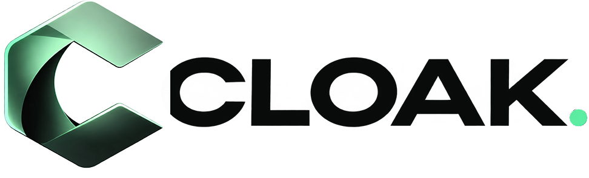
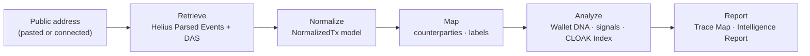

<p align="center">
  <picture>
    <source media="(prefers-color-scheme: dark)" srcset="assets/cloak-logo.png" />
    
  </picture>
</p>

<h1 align="center">Technical Documentation</h1>

<p align="center">
  Wallet-privacy intelligence for Solana.<br/>
  How CLOAK reads public chain data, what it computes, and exactly how every number is derived.
</p>

<p align="center">
  <a href="https://www.getcloak.net">Website</a> ·
  <a href="https://www.getcloak.net/app">CLOAK Terminal</a> ·
  <a href="docs/08-cloak-index.md">CLOAK Index spec</a> ·
  <a href="docs/11-api-reference.md">API reference</a>
</p>

---

CLOAK analyzes the **public** footprint of a Solana address — transfer relationships, holdings, behavioral timing, program habits and trading activity — and reports explainable **Exposure Signals** plus the **CLOAK Index**, a deterministic 0–100 observational exposure index.

CLOAK is read-only. It never asks for private keys or recovery phrases, never requests a signature or approval, holds no assets, and **does not make transactions private**. It shows what is already visible so users can make better decisions about wallet separation.



## Documentation

| # | Document | What it covers |
|---|---|---|
| 01 | [Overview](docs/01-overview.md) | Problem, scope, design principles, data modes |
| 02 | [Architecture](docs/02-architecture.md) | Components, request lifecycle, deployment topology, testing |
| 03 | [Data sources & ingestion](docs/03-data-sources-and-ingestion.md) | Helius endpoints, pagination, retries, timeouts, caching |
| 04 | [Normalization model](docs/04-normalization-model.md) | `NormalizedTx`, classification rules, holdings, coverage |
| 05 | [Counterparty analysis](docs/05-counterparty-analysis.md) | Leg extraction, dust filtering, venue attribution, aggregation |
| 06 | [Wallet DNA](docs/06-wallet-dna.md) | Heatmaps, peak window, HHI, cadence, trading patterns |
| 07 | [Exposure signals](docs/07-exposure-signals.md) | Every signal rule: trigger, severity, confidence, evidence, limitation |
| 08 | [CLOAK Index](docs/08-cloak-index.md) | Methodology `cloak-index/1.0`: components, formula, worked example |
| 09 | [Trace Map](docs/09-trace-map.md) | Graph model, edge semantics, bounded second hop |
| 10 | [Scan protocol](docs/10-scan-protocol.md) | NDJSON streaming, the five stages, error semantics |
| 11 | [API reference](docs/11-api-reference.md) | All REST endpoints, schemas, errors, rate limits |
| 12 | [Security & privacy](docs/12-security-and-privacy.md) | Threat model, read-only guarantees, data handling |
| 13 | [Terminal client](docs/13-terminal-client.md) | Sessions, state machine, local storage, export/import format |
| 14 | [Demo dataset](docs/14-demo-dataset.md) | The fictional "Specimen 07" wallet and its guarantees |
| 15 | [Self-hosting & operations](docs/15-self-hosting-and-operations.md) | Configuration, deployment, health, cost model |
| 16 | [Limitations](docs/16-limitations.md) | What CLOAK cannot see or claim |
| — | [Glossary](docs/glossary.md) | Terms used throughout |

**Machine-readable reference**

- [`reference/types.ts`](reference/types.ts) — the domain model (`NormalizedTx`, `ScanReport`, `ScanEvent`, …), verbatim
- [`reference/cloak-index.ts`](reference/cloak-index.ts) — reference implementation of the CLOAK Index
- [`reference/ScanReport.schema.json`](reference/ScanReport.schema.json), [`reference/ScanEvent.schema.json`](reference/ScanEvent.schema.json) — JSON Schemas generated from the types
- [`examples/`](examples/) — real responses captured from the production API (demo mode)

## At a glance

| | |
|---|---|
| Network | Solana mainnet |
| Data provider | Helius — Parsed Events, DAS `getAssetsByOwner`, Wallet API identity (paid plans) |
| Analysis window | Most recent ≤ 300 transactions by default (configurable 50–500) |
| Index | 7 weighted components, weighted mean over evaluable components, `INSUFFICIENT DATA` below 10 transactions or 60 % evaluable weight |
| Graph | Observed transfers only; ≤ 80 nodes; optional second hop seeded by ≤ 5 counterparties |
| Transport | Scans stream as NDJSON, one event per completed stage |
| Client storage | Browser only (`localStorage`); viewer mode writes nothing |
| Methodology version | `cloak-index/1.0` |

## Quick example

```bash
curl -N -X POST https://www.getcloak.net/api/scan \
  -H 'content-type: application/json' \
  -d '{"address":"CLoAKdemo7SpecimenWa11etXXfictiona1PubKey11","mode":"demo"}'
```

```text
{"type":"stage","stage":"connecting","status":"start","at":…}
{"type":"stage","stage":"connecting","status":"done","detail":"Demo mode · fictional dataset · no provider calls","at":…}
{"type":"stage","stage":"retrieving","status":"start","at":…}
…
{"type":"result","report":{"id":"GR-…","score":{"status":"scored","value":77,"band":"high",…},…}}
```

The demo address is a fictional wallet; every value it returns is simulated and labeled `DEMO DATA`. See [Scan protocol](docs/10-scan-protocol.md) and [`examples/scan-stream.demo.ndjson`](examples/scan-stream.demo.ndjson).

## Principles

1. **Evidence for every finding.** Each signal carries the transaction, account or mint references it was derived from.
2. **Limitations stated, not implied.** Each signal says what it cannot tell you.
3. **Missing data is not privacy.** Components that cannot be evaluated are excluded from the index, never scored as zero.
4. **Deterministic.** The same inputs always produce the same report, score and ordering.
5. **Bounded.** Pagination, graph expansion and provider calls all have hard server-side caps.
6. **No fabricated attribution.** CLOAK never infers real-world identities or locations; public labels are shown with their source.
7. **No silent fallbacks.** A failed live scan reports the failing stage — it is never replaced with demo data.

## Versioning

The CLOAK Index methodology is versioned independently of the application. Any change to a weight, threshold or formula produces a new `methodologyVersion`. See [CHANGELOG.md](CHANGELOG.md).

## Security

Please report vulnerabilities privately — see [SECURITY.md](SECURITY.md).

## License

Documentation © 2026 CLOAK, licensed under [Creative Commons Attribution 4.0 International (CC BY 4.0)](LICENSE). Code excerpts and files in [`reference/`](reference/) are provided for reference and verification.

---

<sub>CLOAK provides observational analysis of public blockchain data. It does not provide anonymity, custody assets or give financial advice. $CLOAK token utility is planned; no contract address has been published.</sub>
