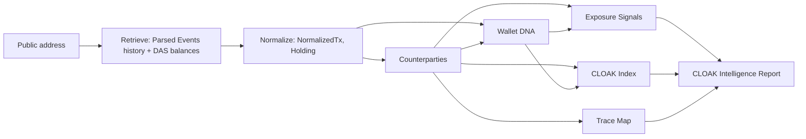

# Overview

CLOAK is a read-only analysis system that measures how much of a Solana address's behavior is observable from public chain data. It retrieves an address's parsed transaction history and balances, derives explainable findings from them, and summarizes those findings as the CLOAK Index, a deterministic 0–100 observational exposure index.

## Contents

- [What CLOAK is](#what-cloak-is)
- [What CLOAK is not](#what-cloak-is-not)
- [The problem](#the-problem)
- [What the system computes](#what-the-system-computes)
- [Design principles](#design-principles)
- [Component map](#component-map)
- [Data modes](#data-modes)

## What CLOAK is

CLOAK takes one public Solana address and reports what any third party could learn about it from the public ledger:

- **who it transacts with** (transfer counterparties, directions, frequencies, amounts),
- **what it holds** (SOL, fungible tokens, NFTs),
- **when it is active** (UTC hour/weekday distribution, cadence),
- **how it uses programs** (non-infrastructure program footprint, swap venues, traded pairs),
- **which public labels it touches** (when the data provider supplies them).

Each finding is an **Exposure Signal** that carries the transaction or account references it was derived from, a severity, a confidence, a written limitation and an educational recommendation. The findings feed the **CLOAK Index** (methodology `cloak-index/1.0`), where 0 means fewer observable exposure indicators and 100 means more.

The system has two user-facing surfaces, both served by one Next.js 16 application:

| Surface | Path | Purpose |
|---|---|---|
| Marketing site | `/`, `/technology`, `/how-it-works`, `/token`, `/faq` | Product description; embeds a demo-mode scan stream |
| CLOAK Terminal | `/app` (Overview, CLOAK Scanner, Wallet DNA, Trace Map, Exposure Signals, Reports, Settings) | The analysis client |

## What CLOAK is not

| CLOAK does not | Detail |
|---|---|
| Make transactions private | It does not mix, shield, route or delay anything. It cannot change what is already on-chain. |
| Custody assets or request signatures | No private keys, seed phrases, signatures, approvals or transactions are ever requested. A connected wallet is used only to read its public key. Inputs that look like a recovery phrase or secret key are rejected (see [Security & privacy](12-security-and-privacy.md)). |
| Identify owners | It never asserts who controls an address. Labels shown come only from the data provider (`source: 'helius-identity'`) or from the fictional demo dataset (`source: 'demo'`). |
| Infer location or time zone | Timing metrics are reported in UTC; no time zone, country or city is derived. |
| Certify privacy | The CLOAK Index is an observational index over the analyzed window, not an anonymity score, security rating or guarantee. |
| Monitor continuously | Each scan is a point-in-time, on-demand read. Continuous monitoring, alerts, a browser extension and a mobile app are **planned, not implemented**. $CLOAK token utility is **not live**. |

## The problem

Solana's ledger is public and permanent. For any address, anyone can read:

- **Balances** — native SOL, every token account, every NFT.
- **Counterparties** — every address on the other side of a SOL or token transfer, with amounts.
- **Timing** — block times for every transaction, which reveal daily and weekly rhythm.
- **Program usage** — which DEXs, marketplaces, staking programs and protocols an address calls.

These facts never expire. Individually they are innocuous; combined, they let an observer cluster addresses, recognize recurring payments, guess a working schedule, and connect a wallet to a labeled entity such as an exchange deposit address. Most users never see their own footprint in aggregate. CLOAK computes it and explains each part.

## What the system computes

| Output | What it is | Specification |
|---|---|---|
| Counterparties | Addresses on the other side of observed SOL/token transfer legs, aggregated per transaction, with direction, SOL sums, token-move counts, first/last seen and up to 5 evidence references each | [05-counterparty-analysis.md](05-counterparty-analysis.md) |
| Wallet DNA | Behavioral profile: UTC heatmap, hourly/weekday/daily series, activity mix, program footprint, median gap, peak 4-hour window, counterparty HHI and top-3 share, trading profile, transfers per week | [06-wallet-dna.md](06-wallet-dna.md) |
| Exposure Signals | Rule-based findings, each with evidence, severity, confidence, limitation and recommendation | [07-exposure-signals.md](07-exposure-signals.md) |
| CLOAK Index | Weighted mean of seven 0..1 indicators over the components that could be evaluated, scaled to 0–100, with a band (`low`, `moderate`, `elevated`, `high`) | [08-cloak-index.md](08-cloak-index.md) |
| Trace Map | Directed graph of observed transfer relationships, with an optional bounded second hop | [09-trace-map.md](09-trace-map.md) |
| CLOAK Intelligence Report | The `ScanReport` object combining all of the above plus coverage, balances and recent transactions; exportable as JSON (`cloak-findings/1`) or a redacted plain-text summary | [10-scan-protocol.md](10-scan-protocol.md), [13-terminal-client.md](13-terminal-client.md) |

For the demo wallet ([`examples/report.demo.json`](../examples/report.demo.json)) a scan covers 96 transactions (93 succeeded, 3 failed) over 73.9 days and produces 20 counterparties, 9 signals, a 21-node / 22-edge Trace Map and a CLOAK Index of 77 (`high`).

## Design principles

| Principle | How it is enforced |
|---|---|
| **Read-only** | The server performs only idempotent read calls (Parsed Events, DAS `getAssetsByOwner`, Wallet API `batch-identity`, `getHealth`). The wallet adapter is used only for `publicKey`; nothing calls `signTransaction`/`signMessage`. |
| **Evidence for every finding** | Every `ExposureSignal` carries a non-empty `evidence: EvidenceRef[]` (transaction signature, account or mint). Counterparties keep up to 5 evidence references, graph edges up to 4. A Vitest case asserts every signal has evidence and a limitation. |
| **Explicit limitations** | Every signal has a `limitation` string. Coverage records whether the window was capped (`limitReached`). When labels could not be checked, a dedicated `label-coverage` signal says so. |
| **Missing data never lowers the index** | Components that cannot be evaluated (too few transactions, labels unavailable on the provider plan) have `raw: null` and their weight is removed from the denominator instead of counting as zero. Below 10 successful timestamped transactions, or below 60% evaluable weight, the index reports `status: 'insufficient'` rather than a low number. |
| **Determinism** | The analysis engine (`lib/analysis/*`) is pure. Every sort has an explicit tiebreak (usually address or signature). The report id is a hash of mode, address and window. Identical input produces an identical report; a test asserts this for the full demo pipeline. |
| **Bounded crawling** | Hard server-side caps: ≤ 500 transactions per scan (default 300), 100 per page, 80 graph nodes, 40 first-hop nodes, 5 second-hop seeds, 50 transactions per seed, 100 addresses per label lookup. |
| **No fabricated identities or locations** | Labels come only from the provider or the fictional dataset. Known-program names are display hints for program ids, never identity labels for wallets. No geolocation or time-zone inference. |
| **Live never falls back to demo** | If the provider key is missing or any provider call fails, a live scan ends with an `error` event naming the failed stage. Demo mode accepts only the fictional demo address. |

## Component map

| Component | Location in the application | Documentation |
|---|---|---|
| Request validation (address, secrets refusal, query params) | `lib/schemas.ts`, `lib/solana/address.ts` | [11-api-reference.md](11-api-reference.md), [12-security-and-privacy.md](12-security-and-privacy.md) |
| Provider client (timeouts, retries, caches) | `lib/server/helius.ts`, `lib/server/cache.ts` | [03-data-sources-and-ingestion.md](03-data-sources-and-ingestion.md) |
| Provider schemas and normalization | `lib/helius/schemas.ts`, `lib/helius/normalize.ts`, `lib/solana/programs.ts` | [04-normalization-model.md](04-normalization-model.md) |
| Counterparty aggregation | `lib/analysis/counterparties.ts` | [05-counterparty-analysis.md](05-counterparty-analysis.md) |
| Wallet DNA | `lib/analysis/dna.ts` | [06-wallet-dna.md](06-wallet-dna.md) |
| Exposure Signals | `lib/analysis/signals.ts` | [07-exposure-signals.md](07-exposure-signals.md) |
| CLOAK Index | `lib/analysis/score.ts` ([reference copy](../reference/cloak-index.ts)) | [08-cloak-index.md](08-cloak-index.md) |
| Trace Map | `lib/analysis/graph.ts`, `components/app/TraceGraph.tsx` | [09-trace-map.md](09-trace-map.md) |
| Scan orchestration and NDJSON stream | `lib/server/scan.ts`, `app/api/scan/route.ts` | [10-scan-protocol.md](10-scan-protocol.md) |
| REST routes, rate limiting | `app/api/**`, `lib/server/http.ts`, `lib/server/rateLimit.ts` | [11-api-reference.md](11-api-reference.md) |
| Terminal client (state, storage, export/import) | `components/app/*` | [13-terminal-client.md](13-terminal-client.md) |
| Fictional dataset | `lib/demo/*` | [14-demo-dataset.md](14-demo-dataset.md) |
| Configuration and deployment | `lib/server/env.ts`, `next.config.ts` | [15-self-hosting-and-operations.md](15-self-hosting-and-operations.md) |
| Architecture as a whole | — | [02-architecture.md](02-architecture.md) |
| Known gaps | — | [16-limitations.md](16-limitations.md) |

## Data modes

Every request carries `mode: 'live' | 'demo'` (default `live`). The mode is part of the report (`ScanReport.mode`) and the report id hash.

| | Live | Demo |
|---|---|---|
| Data source | Helius (Parsed Events, DAS, Wallet API) | Fictional dataset generated from a fixed seed (`lib/demo`) |
| Addresses accepted | Any valid 32-byte base58 public address | Only `CLoAKdemo7SpecimenWa11etXXfictiona1PubKey11`; any other address returns `400 demo_address_only` |
| Requires `HELIUS_API_KEY` | Yes; without it the scan ends with `not_configured` (HTTP 503 on REST routes) | No |
| Provider calls | Yes | None |
| Code path | Normalizer → analysis engine | Same: the fictional raw results are run through the live normalizer and the same analysis engine |
| Labels | Wallet API identity, paid plans only (`labelSupport`: `supported`, `unsupported-plan` or `unavailable`) | Fictional labels, `source: 'demo'`, `labelSupport: 'demo'` |
| Clock | Wall clock | Fixed `DEMO_NOW` = 2026-09-30 21:00 UTC, so output is identical on every run |
| Rate-limit cost (`/api/scan`) | 1 token | 0.25 token |
| Fallback | Never falls back to demo data | Not applicable |

See also: [02-architecture.md](02-architecture.md) · [08-cloak-index.md](08-cloak-index.md) · [16-limitations.md](16-limitations.md) · [glossary.md](glossary.md)
