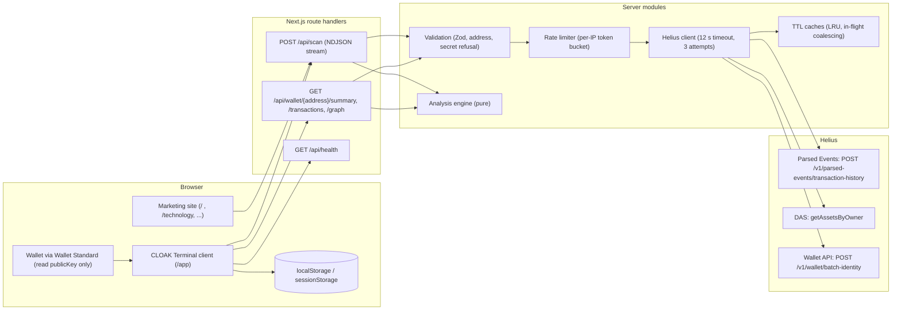
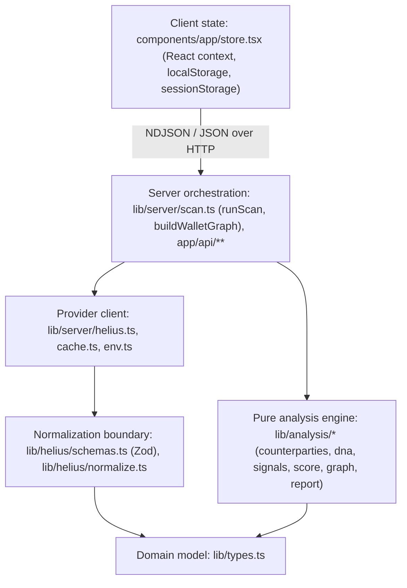
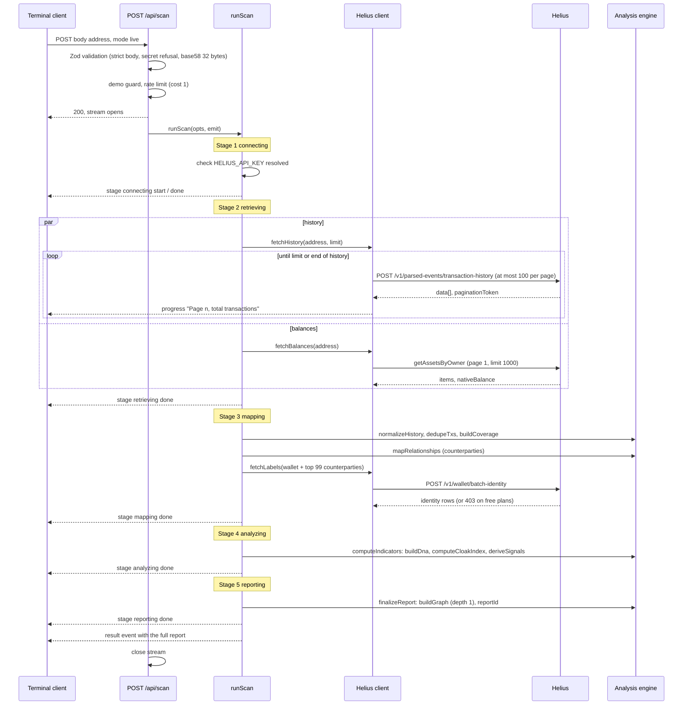
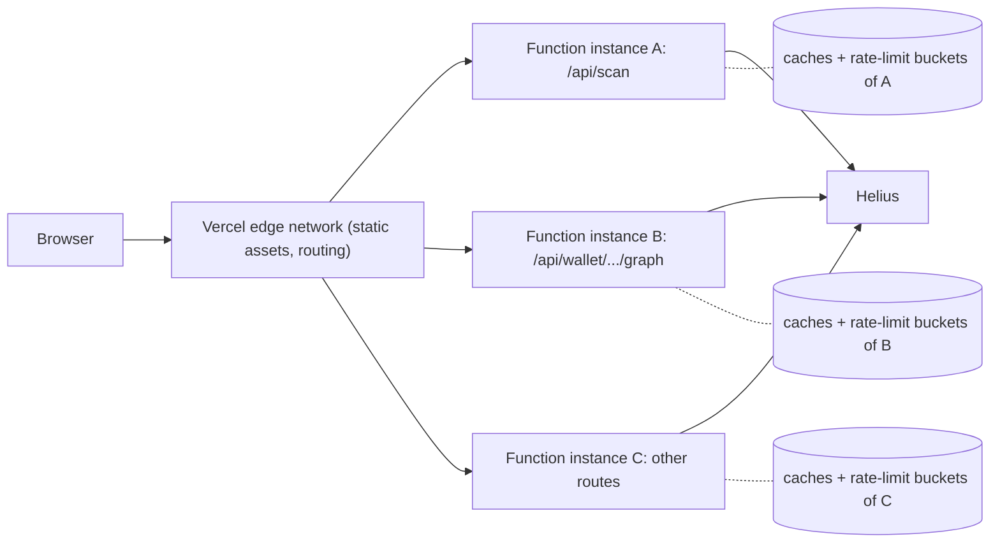

# Architecture

CLOAK is a single Next.js 16 (App Router) application: a browser client, a set of server route handlers, a provider client for Helius, and a pure analysis engine that never sees provider field names. This document describes the layers, the request lifecycle of a live scan, the deployment topology and the test strategy.

## Contents

- [System context](#system-context)
- [Layering](#layering)
- [Lifecycle of a live scan](#lifecycle-of-a-live-scan)
- [Other request paths](#other-request-paths)
- [Deployment topology](#deployment-topology)
- [Module dependency table](#module-dependency-table)
- [Determinism and testing](#determinism-and-testing)

## System context

- The **marketing site** runs a demo-mode `POST /api/scan` stream for its embedded demo dashboard (`components/marketing/scanStream.ts`).
- The **CLOAK Terminal** runs scans, reads the bounded second-hop graph, and polls health (`components/app/scanClient.ts`, `components/app/hooks.ts`).
- The **wallet** integration uses `@solana/wallet-adapter-react`'s `WalletProvider` with an empty adapter list, so wallets are discovered through the Wallet Standard. Only `publicKey` is read (`components/app/wallet.tsx`, `components/app/providers.tsx`).
- The Helius API key is resolved server-side only (`lib/server/env.ts`, guarded by `import 'server-only'`) and is never sent to the browser.

## Layering

### 1. Pure analysis engine (`lib/analysis`)

Functions of the form *normalized data in, plain objects out*. No I/O, no clock reads except where a timestamp default is explicitly injectable (`generatedAt`, `fetchedAt`), no provider types.

| Module | Main exports |
|---|---|
| `counterparties.ts` | `legsFor`, `aggregateCounterparties`, `earliestInboundSol`, `DUST_LAMPORTS` |
| `dna.ts` | `buildDna`, `peakWindow`, `hhi` |
| `signals.ts` | `deriveSignals` |
| `score.ts` | `computeCloakIndex`, `WEIGHTS`, `THRESHOLDS`, `METHODOLOGY_VERSION` |
| `graph.ts` | `buildGraph`, `secondHopSeeds`, `GRAPH_LIMITS` |
| `report.ts` | `buildCoverage`, `dedupeTxs`, `mapRelationships`, `computeIndicators`, `finalizeReport`, `assembleReport`, `reportId` |

Because the engine depends only on `lib/types.ts`, the demo dataset and the live provider travel through exactly the same code.

### 2. Normalization boundary (`lib/helius`)

Every provider response is validated with a lenient Zod schema and converted into the domain model (`NormalizedTx`, `WalletBalances`, `PublicLabel`). Nothing downstream of this boundary references a Helius field name. See [04-normalization-model.md](04-normalization-model.md).

### 3. Server orchestration (`lib/server`, `app/api`)

- `runScan(opts, emit)` in `lib/server/scan.ts` drives the five scan stages and emits one `ScanEvent` per real unit of work. Live mode never falls back to demo data; any `ProviderError` ends the scan with an `error` event naming the stage.
- `buildWalletGraph(address, mode, depth)` produces the Trace Map, optionally with a bounded second hop.
- Route handlers in `app/api/**` validate input (`lib/schemas.ts`), enforce the demo-address guard and rate limits (`lib/server/http.ts`, `lib/server/rateLimit.ts`), and map `ProviderError` codes to HTTP statuses.

### 4. Client state (`components/app`)

`TerminalProvider` (`store.tsx`) holds settings, the current report, scan progress per stage and scan history. It consumes the NDJSON stream through an async generator (`scanClient.ts`). Persistence uses browser storage only; there are no accounts or server-side user records.

| Key | Storage | Content |
|---|---|---|
| `cloak:session` | `localStorage` (wallet/saved sessions) or `sessionStorage` (viewer sessions) | `{ kind, address, startedAt }` |
| `cloak:settings` | `localStorage` | `{ mode, hideBalances }` |
| `cloak:history` | `localStorage` | Up to 25 `HistoryEntry` rows |
| `cloak:reports` | `localStorage` | Up to 6 full `ScanReport`s, newest by `generatedAt`; older ones are shed if the quota is exceeded |
| `cloak:current` | `localStorage` | Id of the open report |

A `viewer` session writes nothing to `localStorage`; history is kept in memory for the tab. Details: [13-terminal-client.md](13-terminal-client.md).

## Lifecycle of a live scan

The client posts `{ address, mode: 'live' }` (the Terminal does not send `limit`, so the server uses `CLOAK_MAX_TX`, default 300). The response is `application/x-ndjson`; each line is one `ScanEvent`.

Stage by stage:

| # | Stage id | Work performed | Provider calls | Failure behavior |
|---|---|---|---|---|
| 1 | `connecting` | Confirm a Helius key is resolvable in live mode | None | `not_configured` error event |
| 2 | `retrieving` | Page through Parsed Events history (≤ 100 per page) and read DAS balances, in parallel | `ceil(limit / 100)` history pages at most, 1 DAS call | Any `ProviderError` (`rate_limited`, `timeout`, `upstream`, ...) ends the scan |
| 3 | `mapping` | Normalize, drop parser errors, dedupe by signature, compute coverage, aggregate counterparties, fetch public labels for up to 100 addresses | 0–1 Wallet API call | `403` becomes `labelSupport: 'unsupported-plan'` and the scan continues; `401` ends the scan; other label errors become `unavailable` and the scan continues |
| 4 | `analyzing` | Wallet DNA, CLOAK Index, Exposure Signals | None | — |
| 5 | `reporting` | Depth-1 Trace Map, report id, `result` event | None | — |

Unexpected (non-provider) exceptions are logged server-side and reported as `upstream` with the message "Unexpected error while scanning." Event schemas and error semantics: [10-scan-protocol.md](10-scan-protocol.md).

## Other request paths

| Route | Server path | Notes |
|---|---|---|
| `GET /api/wallet/{address}/summary` | `fetchHistory` + `fetchBalances` → `dedupeTxs` → `buildCoverage` → `mapRelationships` | No labels, no scoring. Cache header `private, max-age=30`. |
| `GET /api/wallet/{address}/transactions` | `fetchHistoryPage` (one page, ≤ 100) → `normalizeHistory` | Cursor = provider `paginationToken` (live) or numeric offset (demo). |
| `GET /api/wallet/{address}/graph?depth=1\|2` | `buildWalletGraph` | Depth 2 fetches up to 5 seed histories of 50 transactions. Cache header `private, max-age=60`. See [09-trace-map.md](09-trace-map.md). |
| `GET /api/health` | `probeProvider` (JSON-RPC `getHealth`) | Reports `ok`, `degraded` or `demo-only`, limits, methodology version. |

All routes are declared `dynamic = 'force-dynamic'`. Full request/response reference: [11-api-reference.md](11-api-reference.md).

## Deployment topology

The production deployment runs on Vercel (`https://www.getcloak.net`).

| Property | Value |
|---|---|
| Execution model | Route handlers run as serverless functions (Node.js runtime) |
| `maxDuration` | `60` seconds on `app/api/scan/route.ts` and `app/api/wallet/[address]/graph/route.ts`; platform default elsewhere |
| Caches | In-process `TtlCache` instances; **per function instance**, lost on cold start, not shared between instances |
| Rate limits | In-process token buckets keyed by client IP (first `x-forwarded-for` entry, else `x-real-ip`); **per instance**, not global |
| Security headers | Set for every path in `next.config.ts`: `X-Content-Type-Options: nosniff`, `Referrer-Policy: strict-origin-when-cross-origin`, `X-Frame-Options: DENY`, `Permissions-Policy: camera=(), microphone=(), geolocation=()`; `poweredByHeader: false` |
| Secrets | `HELIUS_API_KEY` (or a Helius RPC URL containing `?api-key=`) as a server environment variable |

Because caches and limits are per instance, they are latency and credit optimizations, not sources of truth or global abuse controls. A globally consistent limit requires backing `RateLimiter` with a shared store; this is not implemented. See [15-self-hosting-and-operations.md](15-self-hosting-and-operations.md).

A live scan's worst case is bounded by provider behavior: each provider call may take up to 3 attempts of 12 s plus backoff, and history pages are fetched sequentially. A scan that exceeds `maxDuration` is terminated by the platform; the client sees the stream end without a terminal event (reported as `stream_ended`) or a network error. See [16-limitations.md](16-limitations.md).

## Module dependency table

Arrows point from a module to what it imports. "Pure" means no I/O and no `server-only` import.

| Module | Depends on | Pure | Runs in |
|---|---|---|---|
| `lib/types.ts` | — | Yes | Server and client |
| `lib/solana/address.ts` | — | Yes | Server and client |
| `lib/solana/programs.ts` | — | Yes | Server and client |
| `lib/schemas.ts` | `zod`, `lib/solana/address` | Yes | Server and client |
| `lib/helius/schemas.ts` | `zod` | Yes | Server |
| `lib/helius/normalize.ts` | `lib/helius/schemas`, `lib/solana/programs`, `lib/types` | Yes | Server (and demo pipeline) |
| `lib/analysis/counterparties.ts` | `lib/solana/programs`, `lib/types` | Yes | Server |
| `lib/analysis/dna.ts` | `lib/solana/programs`, `lib/types` | Yes | Server |
| `lib/analysis/score.ts` | `lib/types` | Yes | Server (also imported by the `/technology` page to render the published weights and thresholds) |
| `lib/analysis/signals.ts` | `counterparties`, `score`, `lib/solana/*` | Yes | Server |
| `lib/analysis/graph.ts` | `counterparties` | Yes | Server |
| `lib/analysis/report.ts` | `counterparties`, `dna`, `graph`, `score`, `signals` | Yes | Server |
| `lib/demo/*` | `lib/helius/normalize`, `lib/analysis/report`, `lib/solana/address` | Yes | Server (constants also client) |
| `lib/server/env.ts` | `server-only` | No | Server |
| `lib/server/cache.ts` | `server-only` | No | Server |
| `lib/server/rateLimit.ts` | `env` | No | Server |
| `lib/server/helius.ts` | `env`, `cache`, `lib/helius/*`, `zod` | No | Server |
| `lib/server/scan.ts` | `helius`, `env`, `lib/analysis/report`, `lib/analysis/graph`, `lib/demo` | No | Server |
| `lib/server/http.ts` | `helius`, `rateLimit`, `lib/demo` | No | Server |
| `app/api/**` | `lib/schemas`, `lib/server/*` | No | Server |
| `components/app/scanClient.ts` | `lib/types` | No | Client |
| `components/app/store.tsx` | `scanClient`, `lib/types` | No | Client |

## Determinism and testing

**Determinism.** Given the same normalized input, the engine returns byte-identical output:

- All aggregations sort with explicit tiebreaks: counterparties by `txCount` desc, total SOL desc, address asc; transactions by timestamp desc, slot desc, signature asc; graph edges by `count` desc, id asc; signals by severity, then id; DNA mixes by count desc, key asc.
- The report id is an FNV-1a hash of `mode:address:newest:oldest:txCount`, rendered as `GR-` plus base-36.
- Demo mode pins the clock to `DEMO_NOW` so `generatedAt` and `fetchedAt` are fixed.

Live scans are deterministic with respect to the data returned by the provider; two scans can differ when new transactions arrive or the provider's labels change.

**Tests.** 37 Vitest tests in five suites run in a Node environment (`vitest.config.ts` aliases `server-only` to a stub so server modules import cleanly). Run with `npm test`.

| Suite | Tests | Covers |
|---|---|---|
| `tests/analysis.test.ts` — counterparties | 4 | Counts transactions not legs and tracks direction; ignores dust, failed transactions and swap legs; earliest inbound SOL is the funding source; deterministic order on ties |
| `tests/analysis.test.ts` — dna | 3 | Busiest 4-hour window wraps midnight; HHI values (`[1]` → 1, four equal → 0.25, empty → 0); heatmap and daily series from UTC timestamps |
| `tests/analysis.test.ts` — signals | 3 | Every signal has evidence and a limitation; funding confidence downgrades when the window is partial; `label-coverage` emitted when labels were not checked |
| `tests/analysis.test.ts` — graph | 2 | Directional edges from observed legs only; node cap enforced server-side (`maxFirstHop + 1` nodes, `truncated: true`) |
| `tests/provider.test.ts` — address validation | 5 | Accepts 32-byte addresses, rejects others; base58 round-trip; signature recognition; secret/recovery-phrase refusal with a clear message; demo address is valid |
| `tests/provider.test.ts` — Helius normalization | 4 | Validates and normalizes a documented Parsed Events page (swap kind, protocol, token amount, programs, parser-error row dropped); tolerates additive fields; DAS normalization drops zero balances and detects NFTs; unresolved identity rows ignored |
| `tests/provider.test.ts` — demo pipeline | 1 | Full report is deterministic across runs, scored, excludes the dust-poisoning address and the swap venue from counterparties, and emits the expected signal categories |
| `tests/score.test.ts` | 9 | Weights sum to 100; determinism; `insufficient` below the transaction minimum; low (not insufficient) when data is adequate; saturation to 100; unevaluable components excluded rather than zeroed; concentration needs enough interactions; band boundaries; uniform timing gives zero rhythm signal |
| `tests/env.test.ts` | 3 | `HELIUS_API_KEY` preferred; key read from a Helius `RPC_URL`; non-Helius RPC URLs ignored |
| `tests/share.test.ts` | 3 | Share links never contain the address, counterparties or signatures and use exactly eight keys; demo result round-trips; invalid values fall back to a neutral card |

See also: [01-overview.md](01-overview.md) · [03-data-sources-and-ingestion.md](03-data-sources-and-ingestion.md) · [10-scan-protocol.md](10-scan-protocol.md) · [15-self-hosting-and-operations.md](15-self-hosting-and-operations.md)
