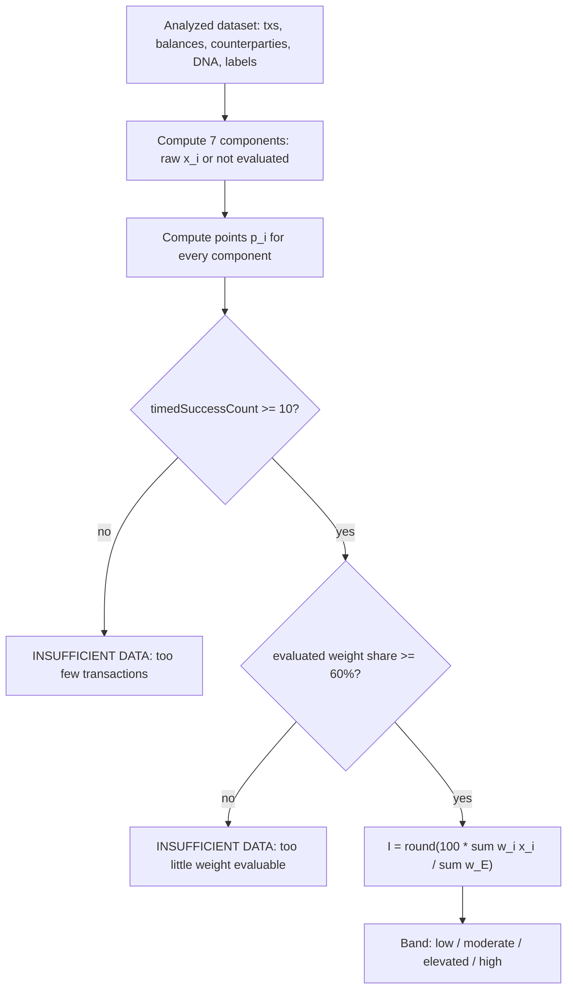

# CLOAK Index methodology (cloak-index/1.0)

The CLOAK Index is an observational exposure index from 0 to 100 computed from a wallet's analyzed public activity. This document is the normative specification of methodology version `cloak-index/1.0`: its inputs, normalization, aggregation, data-sufficiency rules, bands and properties.

Implementation reference: `lib/analysis/score.ts` (copied verbatim, apart from the import path, as [`../reference/cloak-index.ts`](../reference/cloak-index.ts)).

## Contents

1. [Definition](#1-definition)
2. [Scope and non-goals](#2-scope-and-non-goals)
3. [Notation](#3-notation)
4. [Components](#4-components)
5. [Aggregation](#5-aggregation)
6. [Data sufficiency (INSUFFICIENT DATA)](#6-data-sufficiency-insufficient-data)
7. [Bands](#7-bands)
8. [Output format](#8-output-format)
9. [Properties](#9-properties)
10. [Worked example: demo wallet (77)](#10-worked-example-demo-wallet-77)
11. [Worked example: INSUFFICIENT DATA](#11-worked-example-insufficient-data)
12. [Versioning policy](#12-versioning-policy)
13. [Test coverage](#13-test-coverage)
14. [Reference implementation](#14-reference-implementation)

## 1. Definition

The **CLOAK Index** is a deterministic function of an analyzed dataset (a bounded window of normalized transactions, a balance snapshot, aggregated counterparties, a Wallet DNA profile and public-label results) that returns either:

- an integer $I \in [0, 100]$, where **0 means fewer observable exposure signals** and **100 means more observable exposure signals** were found in the analyzed data; or
- the status **INSUFFICIENT DATA**, when the dataset is too small or too incomplete to support a number.

The Index measures how much linkable, publicly readable structure is present in what CLOAK observed. It is relative to the analyzed window: the same wallet can score differently under a larger or smaller window.

## 2. Scope and non-goals

The CLOAK Index is **not**:

- **an anonymity score.** A low value does not mean a wallet is anonymous or unlinkable. It means fewer of the seven indicators below were observed in the analyzed window.
- **a privacy certification.** No value certifies that a wallet is "private" or "safe".
- **a security rating.** The Index says nothing about key management, contract risk, phishing exposure or asset safety.
- **identity attribution.** CLOAK does not infer who controls an address. The only identity data used are third-party public labels, which CLOAK does not verify.

The Index does not use off-chain data other than provider-supplied labels and prices, and it does not model adversaries (exchanges, chain-analysis firms) beyond the indicators listed.

## 3. Notation

| Symbol | Meaning |
|---|---|
| $i$ | Component index, one of the seven components in §4 |
| $w_i$ | Weight of component $i$ (`WEIGHTS`), $\sum_i w_i = W = 100$ |
| $x_i$ | Normalized indicator strength of component $i$, $x_i \in [0, 1]$, or $\bot$ (not evaluated) |
| $E$ | Evaluable set: $\{ i : x_i \neq \bot \}$ |
| $W_E$ | Evaluated weight: $\sum_{i \in E} w_i$ |
| $s_E$ | Evaluated weight share in percent: $100 \cdot W_E / W$ |
| $\mathrm{clamp}(v)$ | $\max(0, \min(1, v))$ (`clamp01`) |
| $n_{ts}$ | `timedSuccessCount`: successful transactions with a non-null block time |
| $\mathbb{1}[\cdot]$ | Indicator function, 1 if the condition holds, else 0 |

Constants (from `lib/analysis/score.ts`):

| Constant | Value | Meaning |
|---|---|---|
| `METHODOLOGY_VERSION` | `cloak-index/1.0` | Version string carried by every result |
| `MIN_TX_FOR_SCORE` | 10 | Minimum $n_{ts}$ for any score |
| `MIN_EVALUATED_WEIGHT` | 60 | Minimum $s_E$ (percent) for any score |
| `THRESHOLDS.holdingsSaturation` | 10 | Holdings units at which visibility saturates |
| `THRESHOLDS.repeatedMinTx` | 3 | Shared transactions that make a counterparty "repeated" |
| `THRESHOLDS.repeatedSaturation` | 6 | Repeated counterparties at which the indicator saturates |
| `THRESHOLDS.concentrationMinInteractions` | 5 | Interactions needed before concentration is evaluated |
| `THRESHOLDS.programsSaturation` | 10 | Distinct non-infrastructure programs at which footprint saturates |
| `THRESHOLDS.tradingSaturation` | 15 | Swaps at which trading visibility saturates |
| `THRESHOLDS.labelsSaturation` | 5 | Labeled-counterparty transactions at which labeling saturates |

## 4. Components

| Key | Label | $w_i$ | Input | Normalization $x_i$ | Saturates at | Evaluable when |
|---|---|---|---|---|---|---|
| `holdings` | Visible holdings | 15 | Balance snapshot | $\mathrm{clamp}\big((f + 0.5\,n + \mathbb{1}[\text{lamports} > 0]) / 10\big)$ | 10 units | Always |
| `repeated` | Repeated counterparties | 20 | Counterparties | $\mathrm{clamp}(r / 6)$ | 6 counterparties | Always |
| `concentration` | Relationship concentration | 15 | Counterparties, DNA | $\mathrm{clamp}(\text{top3Share})$ | 1.0 | $\text{interactions} \ge 5$ |
| `temporal` | Activity rhythm | 15 | DNA hourly histogram | $\mathrm{clamp}\big((p - 4/24) / (1 - 4/24)\big)$ | $p = 1$ | $n_{ts} \ge 10$ |
| `programs` | Program footprint | 10 | DNA programs | $\mathrm{clamp}(d / 10)$ | 10 programs | Always |
| `trading` | Public trading | 15 | DNA trading | $\mathrm{clamp}(\text{swaps} / 15)$ | 15 swaps | Always |
| `labels` | Public labeling | 10 | Labels | $1$ if the wallet is labeled, else $\mathrm{clamp}(\ell / 5)$ | 5 transactions | `labelSupport` ∈ {`supported`, `demo`} |

The weights sum to 100.

### 4.1 Visible holdings (`holdings`, $w = 15$)

- $f$ = number of fungible holdings; $n$ = number of NFT holdings (each counts half); plus one unit if the wallet holds any SOL.
- $x = \mathrm{clamp}((f + 0.5n + \mathbb{1}[\text{lamports}>0]) / 10)$.
- Holdings come from one DAS `getAssetsByOwner` page of up to 1,000 assets; zero balances are dropped during normalization ([04 — Normalization model](04-normalization-model.md)).

### 4.2 Repeated counterparties (`repeated`, $w = 20$)

- $r$ = number of counterparties with `txCount ≥ 3`.
- $x = \mathrm{clamp}(r / 6)$.
- Counterparties are derived from successful, non-venue transfer legs above dust (10,000 lamports), excluding program ids ([05 — Counterparty analysis](05-counterparty-analysis.md)).

### 4.3 Relationship concentration (`concentration`, $w = 15$)

- interactions $= \sum_c \text{txCount}_c$ over all counterparties.
- top3Share $=$ (sum of the three largest `txCount` values) / interactions (`dna.top3CounterpartyShare`).
- $x = \mathrm{clamp}(\text{top3Share})$ if interactions $\ge 5$; otherwise $\bot$.
- Rationale: with fewer than five interactions, a top-3 share is close to 1 by construction and carries no information.

### 4.4 Activity rhythm (`temporal`, $w = 15$)

- $p$ = share of timestamped transactions inside the busiest contiguous 4-hour UTC window, wrapping midnight (`dna.peakWindowShare`, [06 — Wallet DNA](06-wallet-dna.md)).
- Under perfectly uniform activity, $p = 4/24 \approx 0.1667$. The normalization maps uniform activity to 0 and all activity in one window to 1:

$$x_{\text{temporal}} = \mathrm{clamp}\left(\frac{p - 4/24}{1 - 4/24}\right)$$

- Evaluable only when $n_{ts} \ge 10$ (`MIN_TX_FOR_SCORE`); otherwise $\bot$.
- Note: the gate counts successful timestamped transactions, while $p$ is computed by Wallet DNA over all timestamped transactions, including failed ones.

### 4.5 Program footprint (`programs`, $w = 10$)

- $d$ = number of distinct programs invoked by successful transactions, excluding infrastructure programs (System, SPL Token, Token-2022, Associated Token Account, Compute Budget, Memo v1 and v2; `PLUMBING_PROGRAMS` in `lib/solana/programs.ts`).
- $x = \mathrm{clamp}(d / 10)$.

### 4.6 Public trading (`trading`, $w = 15$)

- swaps = successful transactions classified `swap` (`dna.trading.swapCount`).
- $x = \mathrm{clamp}(\text{swaps} / 15)$.

### 4.7 Public labeling (`labels`, $w = 10$)

- If `labelSupport` is `unsupported-plan` or `unavailable`: $x = \bot$.
- Else if the analyzed wallet itself carries a public label: $x = 1$.
- Else $\ell$ = sum of `txCount` over counterparties that carry a label, and $x = \mathrm{clamp}(\ell / 5)$.

## 5. Aggregation

The Index is the weighted mean of the evaluable components, scaled to 100 and rounded to the nearest integer:

$$I = \mathrm{round}\left(100 \cdot \frac{\sum_{i \in E} w_i\, x_i}{\sum_{i \in E} w_i}\right)$$

`Math.round` is used (halves round up).

Each component also reports the **points** it contributes after renormalization, rounded to two decimals:

$$p_i = \begin{cases} \mathrm{round}_2\left(\dfrac{100 \cdot w_i\, x_i}{W_E}\right) & i \in E \\ 0 & i \notin E \end{cases}$$

Points are presentation values. $I$ is computed from the unrounded weighted sum, so $\sum_i p_i$ can differ from $I$ by rounding (§10 shows 76.74 points → 77).

The reported `evaluatedWeight` is $\mathrm{round}_2(s_E)$, a percentage of total weight (100 when every component is evaluable).

Implementation excerpt:

```ts
const evaluated = comps.filter((c) => c.raw !== null)
const evaluatedWeight = evaluated.reduce((a, c) => a + c.weight, 0)
// ...
points: c.raw === null || !evaluatedWeight ? 0 : round2((c.weight * c.raw * 100) / evaluatedWeight),
// ...
const weighted = evaluated.reduce((a, c) => a + c.weight * (c.raw as number), 0)
const value = Math.round((weighted / evaluatedWeight) * 100)
```

### Computation flow



## 6. Data sufficiency (INSUFFICIENT DATA)

A result has `status: "insufficient"` and `value: null` when either rule applies. Rules are checked in this order; the first that applies supplies the reason.

| # | Rule | Exact `reason` string |
|---|---|---|
| 1 | $n_{ts} < 10$ (`MIN_TX_FOR_SCORE`) | `Only {n} successful timestamped transactions in the analyzed window; at least 10 are required.` |
| 2 | $s_E < 60$ (`MIN_EVALUATED_WEIGHT`) | `Only {s_E rounded to 0 dp}% of indicator weight could be evaluated; at least 60% is required.` |

In both cases `components` (with points computed as in §5) and `methodologyVersion` are still returned so the terminal can show what was measured. No `band` and no `evaluatedWeight` are returned.

**Reachability of rule 2 under v1.0 weights.** Only three components can be unevaluable: `concentration` (15), `temporal` (15) and `labels` (10). `temporal` is unevaluable exactly when $n_{ts} < 10$, which rule 1 already catches. Once rule 1 passes, at most `concentration` and `labels` can be excluded, so $s_E \ge 75$. Rule 2 therefore cannot fire with the default `WEIGHTS`; it exists as a guard for alternative weight vectors passed to `computeCloakIndex(input, w)` and for future methodology versions.

INSUFFICIENT DATA is intentionally distinct from a low score. A wallet with almost no activity is not "low exposure"; there is simply not enough evidence to say.

## 7. Bands

| Band | Range |
|---|---|
| `low` | $I < 25$ |
| `moderate` | $25 \le I < 50$ |
| `elevated` | $50 \le I < 75$ |
| `high` | $I \ge 75$ |

```ts
export function scoreBand(value: number): 'low' | 'moderate' | 'elevated' | 'high' {
  if (value < 25) return 'low'
  if (value < 50) return 'moderate'
  if (value < 75) return 'elevated'
  return 'high'
}
```

Bands are labels for the reader. They carry no information beyond $I$ and are not thresholds for any automated action.

## 8. Output format

The result is a `CloakIndex` discriminated union (see [`../reference/types.ts`](../reference/types.ts)):

```ts
type CloakIndex =
  | { status: 'scored'; value: number; band: 'low' | 'moderate' | 'elevated' | 'high';
      components: ScoreComponent[]; evaluatedWeight: number; methodologyVersion: string }
  | { status: 'insufficient'; value: null; reason: string;
      components: ScoreComponent[]; methodologyVersion: string }

interface ScoreComponent {
  key: string      // holdings | repeated | concentration | temporal | programs | trading | labels
  label: string
  weight: number   // w_i
  raw: number | null // x_i, or null when not evaluated
  points: number   // p_i
  basis: string    // human-readable explanation of the measurement
}
```

Components are always returned in the order of §4. The `basis` string states the measured quantity and the saturation point, or `Not evaluated — …` with the reason (for example `Not evaluated — identity labels require a paid Helius plan`).

## 9. Properties

**Determinism.** `computeCloakIndex` is a pure function of its input. It reads no clock, randomness or environment. Identical inputs (including a `structuredClone` of the input) produce identical outputs.

**Boundedness.** Every $x_i \in [0, 1]$ by `clamp01`, and $I$ is a weighted mean of values in $[0, 1]$ scaled by 100, so $0 \le I \le 100$. $I = 100$ requires every evaluable component to be saturated; $I = 0$ requires every evaluable component to be zero.

**Monotonicity in each indicator.** For a fixed evaluable set $E$, $I$ is non-decreasing in each $x_i$ (its partial derivative is $100\,w_i / W_E > 0$ before rounding), and each $x_i$ is non-decreasing in its underlying count or share. Observing more of any indicator never lowers the Index. Monotonicity does not hold across changes to $E$ itself: making a previously unevaluable component evaluable adds it to the mean, which can raise or lower $I$.

**Missing-data neutrality.** An unevaluable component is excluded from both numerator and denominator rather than counted as zero. Missing data never makes a wallet look less exposed.

Numeric example, using the demo wallet's component values (§10) with label lookup unavailable (`labelSupport: "unsupported-plan"`):

| Treatment | Computation | Result |
|---|---|---|
| Exclude `labels` (CLOAK) | $W_E = 90$; $I = \mathrm{round}(100 \cdot 66.741 / 90) = \mathrm{round}(74.16)$ | **74** |
| Zero-fill `labels` (not used) | $W = 100$; $I = \mathrm{round}(100 \cdot 66.741 / 100) = \mathrm{round}(66.74)$ | 67 |

Zero-filling would subtract 7 points because a provider plan lacks a feature, which says nothing about the wallet. Excluding the component reports the mean of what was actually measured, and `evaluatedWeight: 90` plus the `label-coverage` signal ([07 — Exposure Signals](07-exposure-signals.md#11-label-coverage)) disclose the gap.

**Window relativity.** All inputs come from the analyzed window (up to `CLOAK_MAX_TX` transactions, default 300). The Index of a partial window describes that window, not the wallet's full history.

## 10. Worked example: demo wallet (77)

Source: [`../examples/report.demo.json`](../examples/report.demo.json), fictional wallet `CLoAKdemo7SpecimenWa11etXXfictiona1PubKey11`. Coverage: 96 transactions (93 successful, 3 failed) over 73.9 days, full window, $n_{ts} = 93$, `labelSupport: "demo"`.

Component inputs and normalization:

| Component | Input observed | $x_i$ |
|---|---|---|
| holdings | 4 fungible, 2 NFT, SOL present → $4 + 0.5 \cdot 2 + 1 = 6$ units | $6/10 = 0.6$ |
| repeated | 6 counterparties with ≥ 3 transactions | $6/6 = 1$ |
| concentration | top 3 = 13 + 11 + 7 = 31 of 56 interactions (≥ 5, evaluable) | $31/56 = 0.553571$ |
| temporal | $p = 0.802083$ (11:00–15:00 UTC); $n_{ts} = 93 \ge 10$ | $(0.802083 - 0.166667)/0.833333 = 0.7625$ |
| programs | 3 distinct non-infrastructure programs | $3/10 = 0.3$ |
| trading | 29 swaps | $\mathrm{clamp}(29/15) = 1$ |
| labels | wallet unlabeled; 7 transactions with a labeled counterparty | $\mathrm{clamp}(7/5) = 1$ |

All seven components are evaluable: $W_E = 100$, $s_E = 100\%$. Rule 1 passes (93 ≥ 10) and rule 2 passes (100 ≥ 60).

Points ($W_E = 100$, so $p_i = w_i \cdot x_i$, rounded to 2 dp):

| Component | $w_i$ | $x_i$ | $w_i x_i$ (unrounded) | $p_i$ |
|---|---|---|---|---|
| holdings | 15 | 0.6 | 9.000000 | 9 |
| repeated | 20 | 1 | 20.000000 | 20 |
| concentration | 15 | 0.553571 | 8.303571 | 8.3 |
| temporal | 15 | 0.7625 | 11.437500 | 11.44 |
| programs | 10 | 0.3 | 3.000000 | 3 |
| trading | 15 | 1 | 15.000000 | 15 |
| labels | 10 | 1 | 10.000000 | 10 |
| **Sum** | **100** | | **76.741071** | **76.74** |

$$I = \mathrm{round}\left(100 \cdot \frac{76.741071}{100}\right) = \mathrm{round}(76.74) = 77$$

Sum of displayed points: 9 + 20 + 8.3 + 11.44 + 3 + 15 + 10 = 76.74 → 77. The points are pre-rounded per component; the Index itself is computed from the unrounded sum (here both round to 77). $77 \ge 75$, so the band is `high`.

Serialized result (abridged to three components):

```json
{
  "status": "scored",
  "value": 77,
  "band": "high",
  "components": [
    { "key": "holdings", "label": "Visible holdings", "weight": 15, "raw": 0.6,
      "basis": "4 fungible, 2 NFT, SOL present — saturates at 10", "points": 9 },
    { "key": "concentration", "label": "Relationship concentration", "weight": 15, "raw": 0.5535714285714286,
      "basis": "Top 3 counterparties hold 55% of 56 transfer interactions", "points": 8.3 },
    { "key": "temporal", "label": "Activity rhythm", "weight": 15, "raw": 0.7625000000000001,
      "basis": "80% of activity in the busiest 4h UTC window (uniform ≈ 17%)", "points": 11.44 }
  ],
  "evaluatedWeight": 100,
  "methodologyVersion": "cloak-index/1.0"
}
```

## 11. Worked example: INSUFFICIENT DATA

Illustrative input (not a captured output; the result below was produced by running the reference implementation): a live wallet with 8 successful timestamped transactions, 1 fungible token plus SOL, counterparties with transaction counts 4, 1 and 1, one non-infrastructure program, 2 swaps, $p = 0.5$, and `labelSupport: "unsupported-plan"`.

| Component | $x_i$ | Evaluable | $p_i$ ($W_E = 75$) |
|---|---|---|---|
| holdings | $(1 + 0 + 1)/10 = 0.2$ | yes | $100 \cdot 15 \cdot 0.2 / 75 = 4$ |
| repeated | $1/6 = 0.1667$ | yes | 4.44 |
| concentration | $6/6 = 1$ (6 interactions ≥ 5) | yes | 20 |
| temporal | — | no ($n_{ts} = 8 < 10$) | 0 |
| programs | $1/10 = 0.1$ | yes | 1.33 |
| trading | $2/15 = 0.1333$ | yes | 2.67 |
| labels | — | no (`unsupported-plan`) | 0 |

Rule 1 applies because $n_{ts} = 8 < 10$, so no value is computed even though $s_E = 75\% \ge 60\%$:

```json
{
  "status": "insufficient",
  "value": null,
  "reason": "Only 8 successful timestamped transactions in the analyzed window; at least 10 are required.",
  "components": [
    { "key": "holdings", "label": "Visible holdings", "weight": 15, "raw": 0.2, "basis": "1 fungible, 0 NFT, SOL present — saturates at 10", "points": 4 },
    { "key": "temporal", "label": "Activity rhythm", "weight": 15, "raw": null, "basis": "Not evaluated — too few timestamped transactions", "points": 0 },
    { "key": "labels", "label": "Public labeling", "weight": 10, "raw": null, "basis": "Not evaluated — identity labels require a paid Helius plan", "points": 0 }
  ],
  "methodologyVersion": "cloak-index/1.0"
}
```

(`components` abridged to three of seven entries.) The terminal displays `INSUFFICIENT DATA` with the reason; the scan stream's `analyzing` stage reports `CLOAK Index INSUFFICIENT DATA` ([10 — Scan protocol](10-scan-protocol.md)).

## 12. Versioning policy

- Every result carries `methodologyVersion` (currently `cloak-index/1.0`), and every `ScanReport` repeats it at the top level.
- Any change to a weight, threshold, normalization formula, evaluability rule, sufficiency rule or band boundary bumps the version. Scores computed under different versions are not comparable.
- Changes to upstream analysis that alter component inputs (for example the dust threshold or the infrastructure-program list) are recorded in the changelog with the methodology version they affect.
- History: [`../CHANGELOG.md`](../CHANGELOG.md).

Consumers storing scores should store `methodologyVersion` alongside `value` and compare only within a version.

## 13. Test coverage

`tests/score.test.ts` (Vitest) asserts:

| Test | Property checked |
|---|---|
| weights sum to 100 | $\sum_i w_i = 100$ |
| is deterministic for identical input | Same output for an input and its `structuredClone` |
| reports INSUFFICIENT DATA below the transaction minimum instead of a low score | $n_{ts} = 9$ → `status: "insufficient"`, `value: null` |
| scores a wallet with almost no indicators low, not insufficient, when data is adequate | Empty wallet with $n_{ts} = 50$ → scored, value 0 |
| saturates to 100 when every indicator is maxed | Value 100, band `high`, points sum ≈ 100 |
| excludes unevaluable components instead of counting them as zero | `unsupported-plan` → labels `raw: null`, `points: 0`, higher value, `evaluatedWeight` reduced by 10 |
| does not evaluate concentration with too few interactions | 2 interactions → concentration `raw: null` |
| maps bands at documented boundaries | 0, 24 → low; 25 → moderate; 50 → elevated; 75 → high |
| treats uniform timing as zero rhythm signal | $p = 4/24$ → temporal $x \approx 0$ |

`tests/provider.test.ts` additionally runs the demo dataset through the full pipeline and checks the report is deterministic.

## 14. Reference implementation

[`../reference/cloak-index.ts`](../reference/cloak-index.ts) is the scoring module as shipped (`lib/analysis/score.ts`), with only its type import path changed to `./types`. It exports `METHODOLOGY_VERSION`, `MIN_TX_FOR_SCORE`, `MIN_EVALUATED_WEIGHT`, `WEIGHTS`, `THRESHOLDS`, `scoreBand`, `computeComponents` and `computeCloakIndex`. It has no runtime dependencies; with [`../reference/types.ts`](../reference/types.ts) beside it, it can be run directly (for example with `node --experimental-strip-types`) to reproduce any published score from the report's inputs.

See also: [07 — Exposure Signals](07-exposure-signals.md) · [06 — Wallet DNA](06-wallet-dna.md) · [16 — Limitations](16-limitations.md) · [../CHANGELOG.md](../CHANGELOG.md)
