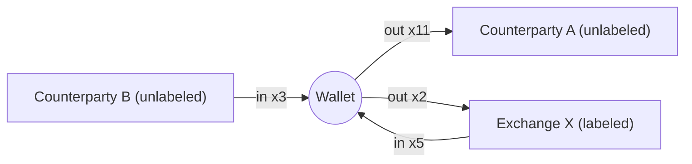
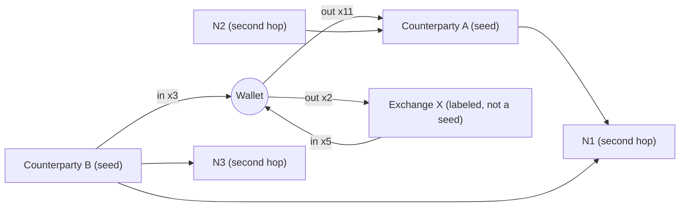

# Trace Map

The Trace Map is a directed graph of the analyzed wallet's observed transfer relationships. An edge exists only where the two addresses appeared on opposite sides of a SOL or token transfer leg; nothing is inferred. An optional second hop expands a few of the strongest unlabeled counterparties under hard server-side limits.

Implementation reference: `lib/analysis/graph.ts` (`buildGraph`, `secondHopSeeds`, `GRAPH_LIMITS`), `lib/server/scan.ts` (`buildWalletGraph`), `app/api/wallet/[address]/graph/route.ts`, `components/app/TraceGraph.tsx`, `app/app/trace/page.tsx`. Tests: `tests/analysis.test.ts` (suite `graph`).

## Contents

- [Graph model](#graph-model)
- [Edge semantics](#edge-semantics)
- [What is not an edge](#what-is-not-an-edge)
- [Limits](#limits)
- [First hop](#first-hop)
- [Second hop](#second-hop)
- [1-hop and 2-hop shapes](#1-hop-and-2-hop-shapes)
- [API usage](#api-usage)
- [Client rendering](#client-rendering)
- [Example](#example)

## Graph model

```ts
interface WalletGraph {
  center: string
  nodes: GraphNode[]
  edges: GraphEdge[]
  depth: 1 | 2
  truncated: boolean   // true when node/edge caps removed observed relationships
  limits: { maxNodes: number; maxSecondHopSeeds: number; secondHopTxPerSeed: number }
}
```

**`GraphNode`**

| Field | Type | Meaning |
|---|---|---|
| `id` | `string` | Address |
| `role` | `'center' \| 'counterparty' \| 'second-hop'` | Analyzed wallet, first-hop counterparty, or neighbour of a seed |
| `label` | `PublicLabel \| null` | Provider or demo label |
| `txCount` | `number` | Center: number of analyzed transactions (including failed). Counterparty: its `txCount` with the wallet. Second hop: its `txCount` with the seed, within the seed's fetched history |
| `hop` | `0 \| 1 \| 2` | Distance from the center |

**`GraphEdge`**

| Field | Type | Meaning |
|---|---|---|
| `id` | `string` | `"{source}->{target}"` |
| `source`, `target` | `string` | Sender and receiver addresses |
| `count` | `number` | Transactions with at least one transfer leg in this direction |
| `sol` | `number` | Total SOL moved in this direction, rounded to 9 decimals |
| `tokenMoves` | `number` | Token legs in this direction |
| `evidence` | `EvidenceRef[]` | Up to 4 transaction references (`note`: `Outbound transfer` or `Inbound transfer`) |

Edges are returned sorted by `count` descending, then `id` ascending.

## Edge semantics

Edges are built from the same `legsFor` extraction used for counterparties ([05-counterparty-analysis.md](05-counterparty-analysis.md#leg-extraction)), so the same exclusions apply: failed transactions, swap and liquidity transactions, native dust below 10,000 lamports, zero-amount tokens, self-transfers and known program ids produce no edges.

```ts
// lib/analysis/graph.ts — directedEdges (trimmed)
for (const tx of txs) {
  const seenInTx = new Set<string>()
  for (const leg of legsFor(tx, wallet)) {
    if (!keep.has(leg.counterparty)) continue
    const [source, target] = leg.direction === 'out' ? [wallet, leg.counterparty] : [leg.counterparty, wallet]
    const id = `${source}->${target}`
    // create edge on first sight
    e.sol += leg.sol
    if (leg.mint) e.tokenMoves += 1
    if (!seenInTx.has(id)) {
      seenInTx.add(id)
      e.count += 1
      if (e.evidence.length < GRAPH_LIMITS.evidencePerEdge) e.evidence.push(/* tx reference */)
    }
  }
}
```

- **Direction.** A leg from the wallet to a counterparty contributes to the edge `wallet → counterparty` (outbound). A leg from a counterparty to the wallet contributes to `counterparty → wallet` (inbound). A relationship with transfers both ways has two edges.
- **`count`.** Each transaction increments an edge at most once, however many legs it has in that direction. For a first-hop counterparty, the outbound edge's `count` equals its `outCount` and the inbound edge's `count` equals its `inCount`.
- **`sol` and `tokenMoves`** accumulate per leg, like the counterparty sums.
- **Evidence** is the first 4 qualifying transactions in input order (newest first in a scan).

Test: three transactions (two outbound, one inbound) between the wallet and one address yield two nodes and two edges with counts 2 and 1.

## What is not an edge

| Not drawn | Why |
|---|---|
| Swaps and liquidity operations | The other side is a pool or vault, not a chosen counterparty. Trading appears in Wallet DNA instead. |
| Program calls | Calling a program is not a transfer relationship. Program usage appears in the program footprint. |
| Inferred ownership or clustering | CLOAK does not merge addresses, guess common ownership, or draw edges from heuristics such as shared fee payers or timing. |
| Edges between two first-hop counterparties | Not observed from the wallet's own history. They can appear only when one of them is a second-hop seed and the other shows up in its history. |
| Seed-to-center edges in the second hop | The center is excluded from seed neighbourhoods; the center's own edges already cover that relationship. |

The Terminal states this beside every inspection: an edge means the two addresses appeared on opposite sides of a transfer; it does not establish ownership.

## Limits

`GRAPH_LIMITS` (`lib/analysis/graph.ts`) are hard server-side limits; the client cannot raise them. They are also published by `GET /api/health` (`limits.graph`).

| Limit | Value | Effect |
|---|---|---|
| `maxNodes` | 80 | Absolute node cap, including the center |
| `maxFirstHop` | 40 | First-hop counterparties drawn (in counterparty rank order) |
| `maxSecondHopSeeds` | 5 | Counterparties expanded in the second hop |
| `secondHopPerSeed` | 6 | Neighbours kept per seed |
| `secondHopTxPerSeed` | 50 | Transactions fetched and analyzed per seed |
| `evidencePerEdge` | 4 | Evidence references per edge |

With these values a graph has at most 1 + 40 + 5 × 6 = 71 nodes, so `maxNodes` acts as a backstop rather than a binding limit.

`truncated` is `true` when any observed relationship was dropped: more than 40 counterparties exist, a seed has more than 6 eligible neighbours, or the node cap was reached. Test: 120 distinct counterparties yield exactly `maxFirstHop + 1` = 41 nodes and `truncated: true`.

## First hop

```ts
const first = counterparties.slice(0, L.maxFirstHop)
let truncated = counterparties.length > first.length
nodes.set(wallet, { id: wallet, role: 'center', label: walletLabel ?? null, txCount: txs.length, hop: 0 })
for (const c of first) nodes.set(c.address, { id: c.address, role: 'counterparty', label: c.label, txCount: c.txCount, hop: 1 })
const edges = directedEdges(txs, wallet, new Set(first.map((c) => c.address)))
```

The first 40 counterparties in rank order (`txCount` desc, total SOL desc, address asc) become nodes; edges are built only for them. Every scan produces this depth-1 graph in its reporting stage, and it is stored in `ScanReport.graph`; drawing it needs no extra request.

## Second hop

The second hop shows who the wallet's closest counterparties transact with. It is computed only on request (`depth=2`).

### Seed selection

```ts
export function secondHopSeeds(counterparties: Counterparty[]): string[] {
  return counterparties
    .filter((c) => !c.label) // labeled services fan out to thousands of users; skip them
    .slice(0, GRAPH_LIMITS.maxSecondHopSeeds)
    .map((c) => c.address)
}
```

- Seeds are the **most-connected unlabeled** counterparties: the first 5 counterparties in rank order that have no public label.
- **Labeled counterparties are excluded** because labeled addresses are typically services (exchanges, protocols, marketplaces) whose histories fan out to thousands of unrelated users. Expanding them would fill the graph with addresses that say nothing about the wallet, and would spend provider credits doing so.
- Inside `buildGraph`, seeds that are not already first-hop nodes are dropped, and at most 5 are used.

### Per-seed expansion

For each seed, in seed order:

1. **Bounded history.** Fetch the seed's most recent 50 transactions (`fetchHistory(seed, 50)`, one Parsed Events request; live seeds are fetched in parallel) and normalize them. In demo mode a deterministic fictional neighbourhood is generated per seed instead.
2. **Neighbours.** Run `aggregateCounterparties(seedTxs, seed, labels)` from the seed's perspective, then remove the center wallet.
3. **Selection.** Walk neighbours in rank order:
   - stop and set `truncated` once 6 neighbours are picked and another remains;
   - a neighbour that is not yet a node is added as `role: 'second-hop'`, `hop: 2`, unless the graph already has 80 nodes (then stop and set `truncated`);
   - a neighbour that is already a node (another first-hop counterparty, or a second-hop node shared with an earlier seed) is not duplicated but still counts toward the seed's 6 and gets an edge.
4. **Edges.** Build directed edges between the seed and its picked neighbours with the same `directedEdges` logic. An edge id that already exists is kept as is (first writer wins).

```ts
// lib/analysis/graph.ts — second hop (trimmed)
const seeds = [...options.secondHop.keys()].filter((s) => nodes.has(s)).slice(0, L.maxSecondHopSeeds)
for (const seed of seeds) {
  const seedTxs = (options.secondHop.get(seed) ?? []).slice(0, L.secondHopTxPerSeed)
  const neighbours = aggregateCounterparties(seedTxs, seed, labels).filter((c) => c.address !== wallet)
  const picked: Counterparty[] = []
  for (const n of neighbours) {
    if (picked.length >= L.secondHopPerSeed) { truncated = true; break }
    if (!nodes.has(n.address)) {
      if (nodes.size >= L.maxNodes) { truncated = true; break }
      nodes.set(n.address, { id: n.address, role: 'second-hop', label: n.label, txCount: n.txCount, hop: 2 })
    }
    picked.push(n)
  }
  const seedEdges = directedEdges(seedTxs, seed, new Set(picked.map((p) => p.address)))
  for (const [id, e] of seedEdges) if (!edges.has(id)) edges.set(id, e)
}
```

### Properties

- **Bounded cost.** At most 5 extra history requests of 50 transactions each, regardless of how active the seeds are.
- **Partial view by design.** A seed's neighbourhood reflects only its 50 most recent transactions.
- **Labels.** Second-hop nodes carry a label only if the address was part of the wallet's label batch (the wallet plus its top 99 counterparties). Other second-hop addresses are not label-checked.
- **All-or-nothing.** If any seed's history request fails, the whole depth-2 request fails; the Terminal then keeps showing the first-hop graph with a retry option.

## 1-hop and 2-hop shapes

Depth 1: only the wallet's own observed transfers.



Depth 2: unlabeled counterparties A and B are seeds; labeled Exchange X is not expanded. N1 is a neighbour shared by both seeds.



## API usage

```http
GET /api/wallet/{address}/graph?mode=live&depth=2
```

| Parameter | Values | Default |
|---|---|---|
| `address` (path) | 32-byte base58 public address (secret-looking input is refused) | — |
| `mode` | `live` or `demo` | `live` |
| `depth` | `1` or `2` (coerced integer) | `1` |

Response (`200`, `cache-control: private, max-age=60`):

```json
{ "mode": "demo", "demo": true, "graph": { "center": "...", "nodes": [], "edges": [], "depth": 2, "truncated": false, "limits": { "maxNodes": 80, "maxSecondHopSeeds": 5, "secondHopTxPerSeed": 50 } } }
```

Server path (`buildWalletGraph`): fetch the wallet's history with the scan window (`CLOAK_MAX_TX`, so a recent scan's 60 s cache entry is reused on the same instance), normalize and deduplicate, aggregate counterparties, look up labels (live), select seeds, fetch seed histories (depth 2), then `buildGraph`. A depth-2 response is a complete graph (center, first hop and second hop); it replaces the report's depth-1 graph in the view.

**Rate-limit cost** against the scan bucket (`CLOAK_RATE_LIMIT_PER_MIN` tokens per minute per IP):

| Request | Cost |
|---|---|
| Demo, any depth | 0.25 |
| Live, depth 1 | 1 |
| Live, depth 2 | 3 (it fans out to several provider calls) |

The route sets `maxDuration = 60`. Errors: `400 invalid_address`, `400 invalid_query`, `400 demo_address_only`, `429 rate_limited`, and provider errors as listed in [03-data-sources-and-ingestion.md](03-data-sources-and-ingestion.md#error-mapping). Full reference: [11-api-reference.md](11-api-reference.md).

## Client rendering

The Trace Map page (`/app/trace`) renders `report.graph` immediately. Choosing **"+ 2nd hop"** issues the depth-2 request through TanStack Query (cached client-side for 5 minutes). The graph is drawn with React Flow (`@xyflow/react`), loaded client-side only.

### Deterministic radial layout

Positions are a pure function of the graph, so the same report always draws the same picture:

- The center sits at the origin.
- First-hop nodes are spaced evenly around a circle in node order (counterparty rank), starting at the top: angle $\theta_i = 2\pi i / N - \pi/2$.
- **Stronger relationships sit closer:** radius $r_i = R \cdot (1.05 - 0.4 \cdot \text{txCount}_i / \text{maxTxCount}) + 34 \cdot (i \bmod 2)$, with $R = \max(240, 14N)$. The strongest counterparty sits at about 0.65 R, the weakest at about 1.05 R; the alternating 34 px offset reduces label collisions.
- Second-hop nodes fan out behind the first-hop node they share an edge with (or behind the center if none), 190 px further out, spread 0.16 rad apart.
- Node size: center 22 px, second hop 9 px, first hop 10 + 12 · txCount / max px. Edge width: 0.6 + 2.4 · count / maxCount. Edges with `count > 1` are labeled `×count`. Outbound and inbound edges use different colors; publicly labeled nodes are highlighted.

Users can pan, zoom and drag nodes; dragging does not change the stored graph.

### Filters

| Filter | Options | Behavior |
|---|---|---|
| Direction | All, Inbound, Outbound | Applies to edges touching the center: Inbound keeps edges into the wallet, Outbound keeps edges out of it. Second-hop edges are unaffected |
| Minimum transactions | ≥1, ≥2, ≥3, ≥5 | Hides edges whose `count` is below the threshold |
| Labeled only | checkbox | Keeps the center and labeled nodes |
| Search | free text | Case-insensitive match on address or label name; matches are highlighted and others dimmed |

Nodes left without any visible edge are hidden (the center always remains). When the graph has no nodes besides the center, the page states that no wallet-to-wallet transfers were observed and that swaps and program calls are not drawn.

### Inspector

Selecting a node dims everything except its direct neighbours and shows:

- role (Subject, Hop 1, Hop 2) and label with its source ("fictional" for demo labels, "Helius identity" for provider labels);
- for first-hop counterparties, the counterparty record: shared transactions, in/out counts, SOL received and sent, token transfers, distinct mints, first and last seen;
- every edge touching the node with direction, count, SOL and token moves;
- up to 8 evidence references collected from those edges, linked to Solscan in live mode (demo references are fictional and not linked);
- the reminder that an edge does not establish ownership.

A footer restates the server limits and, when `truncated` is `true`, that some observed relationships were omitted.

## Example

The demo scan's depth-1 graph has 21 nodes (center plus 20 counterparties) and 22 edges: 20 relationships, two of which (`7n6s…Lktp` and the fictional exchange `5XuR…rh9K`) have transfers in both directions.

[`examples/graph.depth2.demo.trimmed.json`](../examples/graph.depth2.demo.trimmed.json) is a real `depth=2` demo response (43 nodes, 68 edges in full) trimmed to the subject, three first-hop counterparties and the three second-hop nodes connected to them — 7 nodes and the 11 edges among them:

| Edge | `count` | `sol` | Notes |
|---|---|---|---|
| Wallet → `HVqm…YwrN` | 11 | 16.5 | Equals that counterparty's `outCount` and `solOut`: eleven 1.5 SOL payments |
| Wallet → `7n6s…Lktp` | 9 | 11.868 | Outbound half of a two-way relationship |
| `7n6s…Lktp` → Wallet | 4 | 4.965 | Inbound half; a separate directed edge |
| `5XuR…rh9K` → Wallet | 5 | 62.93 | Labeled "Demo Exchange (fictional)"; withdrawals to the wallet |
| Wallet → `5XuR…rh9K` | 2 | 18.4 | Deposits back to the exchange |
| `7n6s…Lktp` → `FAeU…PQ5C` | 3 | 5.038 | Second hop: from the seed's own history |
| `FAeU…PQ5C` → `7n6s…Lktp` | 2 | 3.855 | |
| `7n6s…Lktp` → `HDmz…Hcum` | 2 | 3.296 | |
| `HDmz…Hcum` → `7n6s…Lktp` | 2 | 4.985 | |
| `7n6s…Lktp` → `74bW…bZRp` | 2 | 3.201 | |
| `74bW…bZRp` → `7n6s…Lktp` | 1 | 0.102 | |

All three second-hop nodes hang off the seed `7n6s…Lktp`; their `txCount` (5, 4, 3) counts transactions *in that seed's history*, not in the subject wallet's. `5XuR…rh9K` appears only as a first-hop node: it is labeled, so it is never used as a seed. Second-hop SOL values carry more decimal places because the fictional neighbourhoods are generated with random amounts (see [14-demo-dataset.md](14-demo-dataset.md)).

The five seeds for this wallet are the five highest-ranked unlabeled counterparties: `7n6s…Lktp` (13 tx), `HVqm…YwrN` (11), `DEuF…6vQs` (5), `7EyV…nkAU` (3) and `3nD7…9LCH` (3). `5XuR…rh9K` (7 tx) ranks third overall but is labeled, so it is not expanded. The response reports `depth: 2`, `truncated: false` and `limits: { maxNodes: 80, maxSecondHopSeeds: 5, secondHopTxPerSeed: 50 }`.

See also: [05-counterparty-analysis.md](05-counterparty-analysis.md) · [11-api-reference.md](11-api-reference.md) · [13-terminal-client.md](13-terminal-client.md) · [../examples/graph.depth2.demo.trimmed.json](../examples/graph.depth2.demo.trimmed.json)
