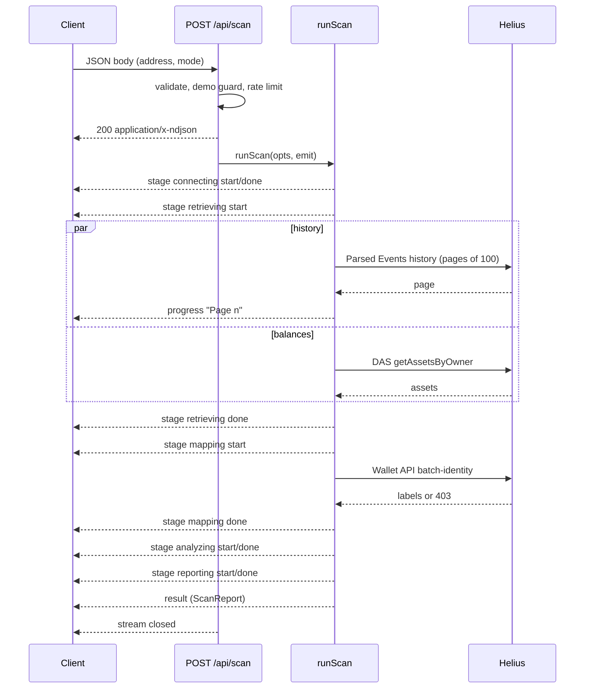

# Scan protocol

A CLOAK scan is a single HTTP request, `POST /api/scan`, whose response body streams newline-delimited JSON events as the server completes each unit of real work. This document specifies the transport, the event schema, the five stages, timing, error and cancellation semantics, and gives a reference client.

Implementation reference: `app/api/scan/route.ts` (transport), `lib/server/scan.ts` (`runScan`, orchestration), `components/app/scanClient.ts` (terminal client). Event types: `ScanEvent` in [`../reference/types.ts`](../reference/types.ts); JSON Schema: [`../reference/ScanEvent.schema.json`](../reference/ScanEvent.schema.json).

## Contents

- [Transport](#transport)
- [Request](#request)
- [Pre-stream errors](#pre-stream-errors)
- [Event schema](#event-schema)
- [Stages](#stages)
- [Timing semantics](#timing-semantics)
- [Error semantics](#error-semantics)
- [Cancellation](#cancellation)
- [Sequence diagram](#sequence-diagram)
- [Reference client (TypeScript)](#reference-client-typescript)
- [curl example](#curl-example)
- [Captured stream (demo)](#captured-stream-demo)

## Transport

| Property | Value |
|---|---|
| Method / path | `POST /api/scan` |
| Request content type | `application/json` |
| Response status (stream) | `200` |
| Response `content-type` | `application/x-ndjson; charset=utf-8` |
| Response `cache-control` | `no-store` |
| Response `x-accel-buffering` | `no` (asks reverse proxies such as nginx not to buffer the stream) |
| Framing | One JSON object per line, each terminated by `\n` (`JSON.stringify(event) + '\n'`) |
| Termination | Exactly one terminal event (`result` or `error`), after which the server closes the stream |
| Function limit | `maxDuration = 60` seconds (route segment config) |

The body is a `ReadableStream` whose `start` callback runs the scan and enqueues each event as it is emitted. Lines are UTF-8 and never contain an unescaped newline, so a client can split on `\n`.

## Request

```json
{
  "address": "CLoAKdemo7SpecimenWa11etXXfictiona1PubKey11",
  "mode": "demo",
  "limit": 300
}
```

| Field | Type | Required | Rules |
|---|---|---|---|
| `address` | string | yes | Trimmed; at most 200 characters; rejected if it looks like a secret (recovery phrase, JSON byte-array key or 64-byte base58 key); must decode to exactly 32 bytes of base58 (32–44 characters). |
| `mode` | `"live"` \| `"demo"` | no | Default `"live"`. `"demo"` accepts only the fictional demo address. |
| `limit` | integer | no | 10–500. The effective window is `min(limit ?? CLOAK_MAX_TX, CLOAK_MAX_TX)`, where `CLOAK_MAX_TX` defaults to 300 (clamped 50–500). |

The object is validated with `.strict()`: unknown keys are rejected with `invalid_request`. The terminal client does not send `limit`, so it always uses the server default. Full parameter reference: [11 — API reference](11-api-reference.md#post-apiscan).

## Pre-stream errors

These are returned as ordinary JSON responses (not a stream), with the standard error envelope and `cache-control: no-store`, in this order of evaluation:

| Order | Condition | Status | `error.code` |
|---|---|---|---|
| 1 | Body is not valid JSON | 400 | `invalid_json` |
| 2 | Body fails schema validation (including secret detection) | 400 | `invalid_request` |
| 3 | `mode: "demo"` with a non-demo address | 400 | `demo_address_only` |
| 4 | Rate limit exceeded (cost: live 1, demo 0.25) | 429 | `rate_limited` (with `retryAfter` seconds) |

Once the stream has started (status 200), all failures are reported in-band as an `error` event.

## Event schema

```ts
type ScanStage = 'connecting' | 'retrieving' | 'mapping' | 'analyzing' | 'reporting'

type ScanEvent =
  | { type: 'stage'; stage: ScanStage; status: 'start' | 'done'; detail?: string; at: number }
  | { type: 'progress'; stage: ScanStage; detail: string; at: number }
  | { type: 'result'; report: ScanReport }
  | { type: 'error'; stage: ScanStage | null; code: string; message: string; retryable: boolean }
```

| Event | Fields | Meaning |
|---|---|---|
| `stage` | `stage`, `status`, optional `detail`, `at` | A stage started (`start`) or finished (`done`). `done` events carry a one-line `detail` summarizing what was done. `at` is the server's `Date.now()` (epoch milliseconds) at emission. |
| `progress` | `stage`, `detail`, `at` | An intermediate message within the current stage (for example one per fetched history page). |
| `result` | `report` | The complete `ScanReport` ([`../reference/ScanReport.schema.json`](../reference/ScanReport.schema.json)). Terminal. |
| `error` | `stage`, `code`, `message`, `retryable` | The scan failed during `stage`. Terminal. |

In a successful scan each of the five stages emits exactly one `start` and one `done`, in order, followed by one `result`. `stage` is typed nullable in `error` for forward compatibility; `runScan` always sets it to the stage in progress.

## Stages

| # | `stage` | Label | Work performed (`lib/server/scan.ts`) |
|---|---|---|---|
| 1 | `connecting` | Establishing Connection | Select the data source. In live mode, fail with `not_configured` if no Helius key is configured. Request validation has already happened in the route. |
| 2 | `retrieving` | Retrieving Public Activity | Live: fetch parsed transaction history (Parsed Events, pages of 100, newest first, up to the window) and balances (DAS `getAssetsByOwner`) **in parallel**. Demo: load the fictional dataset. |
| 3 | `mapping` | Mapping Transactions | Normalize provider results, deduplicate by signature, build coverage, aggregate counterparties, then (live) look up public labels for the wallet plus the first 99 counterparties via the Wallet API batch-identity endpoint and attach them. |
| 4 | `analyzing` | Analyzing Exposure | Build Wallet DNA, compute the CLOAK Index, derive Exposure Signals (`computeIndicators`). Pure, synchronous computation. |
| 5 | `reporting` | Generating Intelligence Report | Build the depth-1 Trace Map graph and assemble the `ScanReport` (`finalizeReport`), then emit `result`. |

Messages emitted per stage (exact templates):

| Stage | Event | Template |
|---|---|---|
| connecting | `done` | Demo: `Demo mode · fictional dataset · no provider calls`. Live: `Helius · Solana mainnet · window up to {limit} transactions` |
| retrieving | `progress` | Demo: `Loaded {n} fictional transactions (DEMO DATA)`. Live: `Page {page} · {total} transactions` after each history page; `Served from 60s cache` when the history came from the in-process cache |
| retrieving | `done` | `{n} transactions · {pages} page[s] · {holdings} holdings` |
| mapping | `progress` | `{n} normalized[ · {k} unparseable skipped] · {failed} failed on-chain` |
| mapping | `progress` | Live only: `Checking {min(100, counterparties + 1)} addresses against public labels` |
| mapping | `done` | `{n} transactions · {c} counterparties · {labelNote}`, where `labelNote` is `labels: not on this plan`, `labels: unavailable` or `{k} public label[s]` |
| analyzing | `done` | `{k} signals · CLOAK Index {value}` or `{k} signals · CLOAK Index INSUFFICIENT DATA` |
| reporting | `done` | `Report {report id}` |

Label lookup failures do not fail the scan: a provider `403` yields `labelSupport: "unsupported-plan"` and any other failure except `401` yields `"unavailable"` ([03 — Data sources and ingestion](03-data-sources-and-ingestion.md)). A `401` (`unauthorized`) is re-thrown and ends the scan.

## Timing semantics

- Every event is emitted when the corresponding work completes. `start` is emitted immediately before a stage's work begins, `done` immediately after it ends.
- There is **no simulated pacing** on either side. The server does not delay events, and the terminal client renders each event as it arrives; stage durations shown in the terminal are computed from the `at` values.
- Consequently a demo scan, which makes no provider calls, completes in a few milliseconds (in the capture below the entire stream spans 2 ms). A live scan's duration is dominated by `retrieving` (provider round-trips) and, to a lesser degree, the label lookup in `mapping`.
- `at` values come from the server clock and are suitable for computing durations, not for ordering across scans or servers.

## Error semantics

When anything throws inside `runScan`, the server emits one `error` event and closes the stream. No `result` follows.

```ts
const err = e instanceof ProviderError ? e : new ProviderError('upstream', 'Unexpected error while scanning.')
emit({ type: 'error', stage, code: err.code, message: err.message, retryable: err.retryable || err.code === 'timeout' })
```

- `stage` is the stage that was in progress.
- **Live mode never falls back to demo data.** A provider failure ends the scan with an error naming the failed stage; no fictional data is substituted.

Possible in-stream error codes:

| `code` | Typical stage | Cause | `retryable` |
|---|---|---|---|
| `not_configured` | connecting | Live mode without `HELIUS_API_KEY` (or a key in `HELIUS_RPC_URL` / `RPC_URL`) | false |
| `unauthorized` | retrieving, mapping | Provider returned 401 (key rejected) | false |
| `forbidden` | retrieving | Provider returned 403 on history or balances (plan lacks the endpoint) | false |
| `rate_limited` | retrieving, mapping | Provider returned 429 after retries | true |
| `timeout` | retrieving, mapping | Provider did not respond within 12 s on the final attempt, or the request was cancelled | true |
| `upstream` | any | Provider 5xx or network error after retries (retryable); other non-2xx status, a JSON-RPC error from `getAssetsByOwner`, or an unexpected exception (not retryable) | depends |
| `invalid_response` | retrieving, mapping | Provider response failed schema validation | false |

Provider calls (`postJson` in `lib/server/helius.ts`) use a 12-second timeout per attempt and up to 3 attempts, retrying only on 429, 5xx, timeouts and network errors, with backoff of `400 · 2^(attempt−1)` ms plus up to 200 ms jitter. An in-stream `error` therefore reflects a failure that persisted through retries.

`retryable: true` means the same request may succeed later without changes. The terminal shows the failed stage's label and the error code, a primary **Retry** button when `retryable` is true, a **Switch to Demo mode** button for `not_configured`, and a secondary **Try again** button for other non-retryable errors.

A client should also treat a stream that ends **without** a terminal event as a failure; the terminal reports this as `stream_ended` (retryable).

## Cancellation

- The route passes the incoming request's `req.signal` to `runScan`, which forwards it to every live provider call (`fetchHistory`, `fetchBalances`, `fetchLabels`).
- When the client aborts (closes the connection, or calls `AbortController.abort()` on its fetch), the signal fires and the in-flight provider `fetch` is aborted. `postJson` raises `ProviderError('timeout', 'Request cancelled.')` and no further pages are requested.
- `runScan` then attempts to emit an `error` event; the enqueue fails silently because the client is gone, and the stream is closed.
- The cancellation is observed only at provider calls. Demo scans and the synchronous analysis stages (`analyzing`, `reporting`) run to completion once started.
- In the terminal, an aborted scan is shown as cancelled, not as an error.

## Sequence diagram



In demo mode the three provider interactions are absent.

## Reference client (TypeScript)

Adapted from `components/app/scanClient.ts`. Works in browsers and in Node 18+ (global `fetch`, `TextDecoder`).

```ts
import type { DataMode, ScanEvent } from './types' // ../reference/types.ts

export class ScanHttpError extends Error {
  constructor(public code: string, message: string, public retryable: boolean) {
    super(message)
  }
}

/** POST /api/scan and yield each NDJSON ScanEvent as the server emits it. */
export async function* streamScan(
  baseUrl: string,
  body: { address: string; mode?: DataMode; limit?: number },
  signal?: AbortSignal,
): AsyncGenerator<ScanEvent> {
  let res: Response
  try {
    res = await fetch(`${baseUrl}/api/scan`, {
      method: 'POST',
      headers: { 'content-type': 'application/json' },
      body: JSON.stringify(body),
      signal,
    })
  } catch (e) {
    if ((e as Error).name === 'AbortError') throw e
    throw new ScanHttpError('network', 'Could not reach the CLOAK server.', true)
  }
  // Pre-stream errors arrive as a JSON error envelope, not a stream.
  if (!res.ok || !res.body) {
    const err = (await res.json().catch(() => null))?.error
    throw new ScanHttpError(err?.code ?? `http_${res.status}`, err?.message ?? `Scan request failed (${res.status}).`, res.status === 429 || res.status >= 500)
  }
  const reader = res.body.getReader()
  const decoder = new TextDecoder()
  let buffer = ''
  while (true) {
    const { value, done } = await reader.read()
    if (done) break
    buffer += decoder.decode(value, { stream: true })
    let nl: number
    while ((nl = buffer.indexOf('\n')) >= 0) {
      const line = buffer.slice(0, nl).trim()
      buffer = buffer.slice(nl + 1)
      if (line) yield JSON.parse(line) as ScanEvent
    }
  }
  const tail = buffer.trim()
  if (tail) yield JSON.parse(tail) as ScanEvent
}
```

Consuming the stream:

```ts
const ctl = new AbortController()
let terminal = false
for await (const ev of streamScan('https://www.getcloak.net', {
  address: 'CLoAKdemo7SpecimenWa11etXXfictiona1PubKey11',
  mode: 'demo',
}, ctl.signal)) {
  if (ev.type === 'stage') console.log(ev.stage, ev.status, ev.detail ?? '')
  else if (ev.type === 'progress') console.log('  ', ev.detail)
  else if (ev.type === 'error') { terminal = true; console.error(ev.code, ev.message, { retryable: ev.retryable }); break }
  else if (ev.type === 'result') { terminal = true; console.log('Index:', ev.report.score); break }
}
if (!terminal) console.error('stream ended without a result')
// ctl.abort() at any point cancels the scan and its provider requests.
```

## curl example

`-N` disables curl's output buffering so lines appear as they are emitted.

```bash
curl -N -X POST https://www.getcloak.net/api/scan \
  -H 'content-type: application/json' \
  -d '{"address":"CLoAKdemo7SpecimenWa11etXXfictiona1PubKey11","mode":"demo"}'
```

## Captured stream (demo)

Captured from the production deployment in demo mode: [`../examples/scan-stream.demo.ndjson`](../examples/scan-stream.demo.ndjson). The final `result` line is truncated in the capture (the full report is [`../examples/report.demo.json`](../examples/report.demo.json)). Apart from that truncation, each line is byte-for-byte what the server emits (compact `JSON.stringify` output, UTF-8).

```text
{"type": "stage", "stage": "connecting", "status": "start", "at": 1791472590037}
{"type": "stage", "stage": "connecting", "status": "done", "detail": "Demo mode · fictional dataset · no provider calls", "at": 1791472590037}
{"type": "stage", "stage": "retrieving", "status": "start", "at": 1791472590037}
{"type": "progress", "stage": "retrieving", "detail": "Loaded 96 fictional transactions (DEMO DATA)", "at": 1791472590037}
{"type": "stage", "stage": "retrieving", "status": "done", "detail": "96 transactions · 1 page · 6 holdings", "at": 1791472590037}
{"type": "stage", "stage": "mapping", "status": "start", "at": 1791472590037}
{"type": "progress", "stage": "mapping", "detail": "96 normalized · 3 failed on-chain", "at": 1791472590037}
{"type": "stage", "stage": "mapping", "status": "done", "detail": "96 transactions · 20 counterparties · 1 public label", "at": 1791472590037}
{"type": "stage", "stage": "analyzing", "status": "start", "at": 1791472590037}
{"type": "stage", "stage": "analyzing", "status": "done", "detail": "9 signals · CLOAK Index 77", "at": 1791472590039}
{"type": "stage", "stage": "reporting", "status": "start", "at": 1791472590039}
{"type": "stage", "stage": "reporting", "status": "done", "detail": "Report GR-0URAI4F", "at": 1791472590039}
{"type": "result", "report": {"id": "GR-0URAI4F", "address": "CLoAKdemo7SpecimenWa11etXXfictiona1PubKey11", "mode": "demo", "score": {"status": "scored", "value": 77, "band": "high"}, "…": "full ScanReport — see examples/report.demo.json"}}
```

Observations: 13 lines; the whole scan spans 2 ms (`1791472590037` → `1791472590039`); there is no `Checking … addresses against public labels` progress line because demo mode makes no provider calls; the mapping `done` line reports the one fictional public label.

See also: [11 — API reference](11-api-reference.md) · [02 — Architecture](02-architecture.md) · [13 — Terminal client](13-terminal-client.md) · [03 — Data sources and ingestion](03-data-sources-and-ingestion.md)
