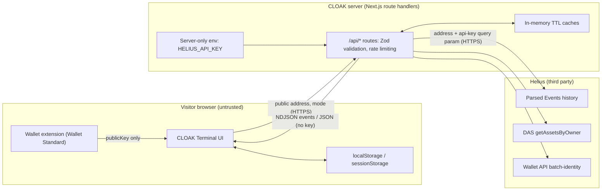

# Security and privacy

This document describes CLOAK's security model: the trust boundaries between the browser, the CLOAK server and the data provider, the controls at each boundary, what data each party can observe, and what CLOAK cannot protect against. Every statement is tied to the implementation in the CLOAK application repository.

## Contents

- [Security goals](#security-goals)
- [Trust boundaries](#trust-boundaries)
- [Threat model](#threat-model)
- [Read-only guarantees](#read-only-guarantees)
- [Secret handling](#secret-handling)
- [Input validation](#input-validation)
- [Abuse controls](#abuse-controls)
- [HTTP security headers](#http-security-headers)
- [Data handling](#data-handling)
- [Privacy limitations of CLOAK itself](#privacy-limitations-of-cloak-itself)
- [What CLOAK cannot protect against](#what-cloak-cannot-protect-against)
- [Responsible disclosure](#responsible-disclosure)

## Security goals

| Goal | Mechanism |
|---|---|
| CLOAK can never move or authorize anything on a user's behalf | No signing calls exist in the client; no server-side keypair exists; the server only issues read requests |
| The provider credential never reaches a browser | Key is read only in `server-only` modules, never prefixed `NEXT_PUBLIC_`, never serialized into a response |
| Secrets pasted by mistake are refused, not processed | `looksLikeSecret` heuristics on client and server, explicit error, no logging |
| A single client cannot exhaust provider credits or server capacity | Per-IP token buckets, bounded pagination, graph caps, timeouts, bounded retries |
| Live failures are never disguised | Live mode never falls back to demo data; errors name the failing stage |
| Scan results stay with the visitor | No database; reports and history are stored only in the visitor's browser |

## Trust boundaries



Three boundaries matter:

1. **Browser → CLOAK server.** Everything arriving from the browser is untrusted. Each route validates its input with Zod before doing any work and rate-limits by client IP (see [Input validation](#input-validation) and [Abuse controls](#abuse-controls)).
2. **CLOAK server → Helius.** The server holds the only credential in the system. Provider responses are treated as untrusted too: every response is validated against a Zod schema (`lib/helius/schemas.ts`) and normalized (`lib/helius/normalize.ts`) before analysis code sees it. A response that does not match fails with `invalid_response` rather than being partially used. See [Data sources and ingestion](03-data-sources-and-ingestion.md).
3. **Wallet extension → CLOAK Terminal.** The wallet supplies a public key. CLOAK never sends the wallet anything to sign.

## Threat model

| Threat | Actor | Control | Residual risk |
|---|---|---|---|
| Phishing a seed phrase or private key through the address field | Malicious third party, or user error | Client and server refuse secret-shaped input with an explicit warning; input is not logged or stored | Heuristic; an unusually formatted secret may pass the heuristic and then fail address validation instead (still rejected, with a generic message) |
| Tricking a user into signing a transaction via CLOAK | Attacker who controls injected script | No signing code paths exist; `X-Frame-Options: DENY` blocks framing | No Content-Security-Policy is set yet (see [HTTP security headers](#http-security-headers)) |
| Exfiltrating the Helius API key | Any client | Key resolved only in `lib/server/env.ts` (`import 'server-only'`); responses never include it; health endpoint reports booleans and an error code only | Operator misconfiguration (for example, adding a `NEXT_PUBLIC_` copy) |
| Burning provider credits | Scripted client | Token-bucket rate limit per IP, hard caps per scan and per graph | Limits are per server instance, not global |
| Provider response injection or schema drift | Compromised or changed upstream | Zod validation of every response; mismatches abort with `invalid_response` | Values that are well-formed but wrong are rendered as provided |
| XSS through imported report files | Malicious `.json` shared with a user | 5 MB cap, structural Zod check, React text rendering only (no `dangerouslySetInnerHTML` anywhere in the app); explorer links use fixed `https://solscan.io/...` prefixes | An imported file can contain fabricated findings; import does not prove authenticity |
| Clickjacking | Hostile site | `X-Frame-Options: DENY` | None known |
| Denial of service on the service | Volumetric attacker | Per-IP buckets on a single instance | Volumetric DoS is out of scope for the application; it is a platform concern |

## Read-only guarantees

CLOAK is read-only analysis. It does not hold assets, does not create transactions, and does not make anything private.

**Wallet connection.** The terminal uses Solana Wallet Adapter (`@solana/wallet-adapter-react`) with an empty adapter list, so wallets are discovered through the **Wallet Standard** (Phantom, Solflare, Backpack and other Standard wallets register themselves). Implementation reference: `components/app/providers.tsx`.

```ts
// components/app/providers.tsx (trimmed)
<WalletProvider wallets={[]} autoConnect onError={onWalletError}>
```

Connecting only reads `publicKey`:

```ts
// components/app/wallet.tsx
/** Connected public key, or null. Read-only: nothing here ever signs. */
export function useConnectedAddress(): string | null {
  const { publicKey } = useWallet()
  return publicKey ? publicKey.toBase58() : null
}
```

The `useWallet()` hook exposes `signTransaction`, `signAllTransactions`, `signMessage` and `sendTransaction`, but CLOAK never destructures or calls them. This is verifiable with a grep over the client and library code:

```bash
grep -rnE "signTransaction|signMessage|signAllTransactions|sendTransaction|signIn" app components lib
# (no output)
```

There is no server-side keypair, no transaction construction code, and no RPC method in the codebase that writes to the chain. The only provider calls are `POST /v1/parsed-events/transaction-history`, the JSON-RPC methods `getAssetsByOwner` and `getHealth`, and `POST /v1/wallet/batch-identity` (`lib/server/helius.ts`).

## Secret handling

### The Helius API key

- **Server-only.** The key is read in `lib/server/env.ts`, which starts with `import 'server-only'`; Next.js fails the build if a client component imports it. All modules that use the key (`lib/server/*`, `app/api/**`) are server code.
- **Never `NEXT_PUBLIC_`.** Next.js inlines `NEXT_PUBLIC_*` variables into the client bundle. The key variable is `HELIUS_API_KEY`, and `.env.example` warns against the prefix. The only `NEXT_PUBLIC_` variables in the codebase are the `$CLOAK` token placeholders and `NEXT_PUBLIC_SITE_URL` (see [Self-hosting and operations](15-self-hosting-and-operations.md#environment-variables)).
- **Resolution order** (`env.heliusKey`):
  1. `HELIUS_API_KEY` (trimmed), if non-empty;
  2. the `api-key` query parameter of `HELIUS_RPC_URL`, if its hostname contains `helius`;
  3. the `api-key` query parameter of `RPC_URL`, if its hostname contains `helius`.

  A URL whose hostname does not contain `helius` is ignored, so a key embedded in some other RPC URL is never forwarded to Helius (covered by `tests/env.test.ts`).
- **Transport.** The key is appended per request as the `api-key` query parameter over HTTPS (`?api-key=${encodeURIComponent(key)}`). Any query string on `HELIUS_RPC_URL` is stripped from the base URL first, so the key is not duplicated.
- **Never returned.** No response body or header contains the key. Provider error messages passed to clients are fixed strings (for example, `The configured Helius API key was rejected.`); upstream error bodies are truncated to 200 characters and only included for non-401/403/429/5xx statuses.
- **Health endpoint.** `GET /api/health` reports `provider.configured` and `provider.reachable` booleans, plus `latencyMs` and a short error code (for example `not_configured`, `unauthorized`, `timeout`). It does not report the key, the RPC URL or any part of either. See [`examples/health.demo-only.json`](../examples/health.demo-only.json).

### Secrets pasted by users

CLOAK never needs a private key or recovery phrase. Input that looks like one is refused loudly (see [Input validation](#input-validation)). On the server, the refusal is a `400 invalid_request` response; nothing on that path is logged. In the browser, the terminal's address form and the marketing site's address check run the same heuristic before any network request is made, so in normal use a pasted secret never leaves the browser. The marketing form additionally clears the field.

## Input validation

All request inputs are validated with Zod in `lib/schemas.ts` before any provider call.

| Input | Rule |
|---|---|
| `address` (body of `POST /api/scan`, path segment of `/api/wallet/[address]/*`) | trimmed string, ≤ 200 characters, not secret-shaped, and a valid Solana public address |
| `mode` | `'live' \| 'demo'`, default `'live'` |
| `limit` (scan) | integer 10–500, optional; further capped by `CLOAK_MAX_TX` |
| `limit` (transactions) | integer 1–100, default 25 |
| `cursor` | ≤ 200 characters, `^[A-Za-z0-9:_-]+$` |
| `depth` (graph) | integer 1–2, default 1 |
| Scan body | `.strict()` — unknown keys are rejected |

**Address decoding.** `isSolanaAddress` (`lib/solana/address.ts`) requires 32–44 characters and a base58 decode that yields exactly 32 bytes. It accepts both on-curve wallet addresses and off-curve program-derived addresses (PDAs), because both are public addresses with analyzable history.

**Secret heuristics.** `looksLikeSecret` returns `true` for any of:

| Pattern | Rule in code | Intended to catch |
|---|---|---|
| Mnemonic | ≥ 12 whitespace-separated words, every word `^[a-z]+$` (case-insensitive) | BIP-39 recovery phrases (the wordlist itself is not checked) |
| Byte array | `^\[\s*\d+(\s*,\s*\d+){31,}\s*\]$`, i.e. a bracketed list of 32 or more integers | Solana CLI keypair JSON (64 numbers) and raw 32-byte seeds |
| Base58 secret key | only base58 characters, decodes to exactly 64 bytes, and length > 80 | Base58-encoded 64-byte secret keys as exported by wallets |

```ts
// lib/solana/address.ts
export function looksLikeSecret(value: string): boolean {
  const s = value.trim()
  const words = s.split(/\s+/)
  if (words.length >= 12 && words.every((w) => /^[a-z]+$/i.test(w))) return true
  if (s.startsWith('[') && /^\[\s*\d+(\s*,\s*\d+){31,}\s*\]$/.test(s)) return true
  const bytes = /^[1-9A-HJ-NP-Za-km-z]+$/.test(s) ? base58Decode(s) : null
  return bytes !== null && bytes.length === 64 && s.length > 80
}
```

The secret check runs before the address check, so a secret receives the explicit warning:

```json
{"error":{"code":"invalid_request","message":"That looks like a private key or recovery phrase. CLOAK never needs secrets — paste a public wallet address only."}}
```

(Captured in [`examples/error.secret-rejected.json`](../examples/error.secret-rejected.json).) Note that a 64-byte transaction signature has the same shape as a base58 secret key, so a signature pasted into the address field is also refused with this message.

**Demo guard.** In `demo` mode every route accepts only the fictional demo address and returns `400 demo_address_only` for anything else, so a real address is never presented as demo data ([`examples/error.demo-address-only.json`](../examples/error.demo-address-only.json)).

## Abuse controls

| Control | Value | Implementation reference |
|---|---|---|
| Scan rate limit | token bucket per client IP; capacity `CLOAK_RATE_LIMIT_PER_MIN` (default 12), refilling at the same rate per minute | `lib/server/rateLimit.ts` (`scanLimiter`) |
| Read rate limit | capacity and refill 4 × the scan limit (default 48/min) | `readLimiter` |
| Cost per request | live scan 1; demo scan 0.25; live graph depth 1 = 1, depth 2 = 3 (scan bucket); demo graph 0.25; health/summary/transactions 1 (read bucket) | `app/api/**` |
| Rate-limit response | `429 rate_limited` with `retryAfter` seconds | `lib/server/http.ts` |
| Transactions per scan | `CLOAK_MAX_TX`, default 300, clamped to 50–500; pages of 100 | `lib/server/env.ts`, `lib/server/helius.ts` |
| Transactions endpoint page | ≤ 100 | `transactionsQuerySchema` |
| Graph caps | 80 nodes, 40 first-hop, 5 second-hop seeds, 6 neighbours per seed, 50 transactions per seed, 4 evidence refs per edge | `GRAPH_LIMITS` in `lib/analysis/graph.ts` |
| Label lookups | ≤ 100 addresses per scan (wallet + top 99 counterparties) in one batch request | `fetchLabels` |
| Provider timeout | 12 s per attempt | `TIMEOUT_MS` |
| Retries | at most 3 attempts, only on 429, 5xx, timeouts and network errors; backoff `400 × 2^(n−1) ms + 0–200 ms jitter` | `postJson` |
| Function duration | `maxDuration = 60` on `/api/scan` and `/api/wallet/[address]/graph` | route files |
| Client cancellation | the request's `AbortSignal` is passed through to provider fetches | `runScan` |

Retries are safe because every request sent through `postJson` is an idempotent read. 401 (`unauthorized`), 403 (`forbidden`) and other 4xx responses are not retried.

**Client IP.** The bucket key is the first entry of `X-Forwarded-For`, then `X-Real-IP`, then the literal `local`. On Vercel these headers are set by the platform. If you self-host behind a proxy that does not overwrite `X-Forwarded-For`, a client can choose its own bucket key; terminate at a proxy that sets the header (see [Self-hosting and operations](15-self-hosting-and-operations.md#rate-limits-and-caches-across-instances)).

**Per-instance scope.** Buckets and caches live in process memory. On serverless platforms each instance has its own buckets, so the effective global limit is (instances × per-instance limit). The `RateLimiter` interface is designed to be backed by a shared store.

## HTTP security headers

`next.config.ts` applies these headers to every path (`/:path*`) and disables the `X-Powered-By` header (`poweredByHeader: false`):

| Header | Value | Effect |
|---|---|---|
| `X-Content-Type-Options` | `nosniff` | Prevents MIME sniffing of responses |
| `Referrer-Policy` | `strict-origin-when-cross-origin` | Cross-origin requests (for example, Solscan links) receive only the origin, never the path or query |
| `X-Frame-Options` | `DENY` | The app cannot be framed (clickjacking defense) |
| `Permissions-Policy` | `camera=(), microphone=(), geolocation=()` | Disables these browser features for the app and any embedded content |

API responses additionally set `cache-control: no-store` (scan, health, errors) or `private, max-age=N` (summary 30 s, transactions 30 s live / 300 s demo, graph 60 s), so shared caches do not store per-address results.

**No Content-Security-Policy is set.** There is currently no `Content-Security-Policy` or `Strict-Transport-Security` header in `next.config.ts` (HTTPS and HSTS on the production deployment are provided by the hosting platform, not the application). A CSP is recommended. A starting point that matches the current app (self-hosted scripts, fonts self-hosted by `next/font`, Wallet Standard extensions injecting into the page, no third-party script origins) would be:

```text
default-src 'self';
script-src 'self' 'unsafe-inline';
style-src 'self' 'unsafe-inline';
img-src 'self' data: blob:;
connect-src 'self';
frame-ancestors 'none';
base-uri 'self';
form-action 'self';
object-src 'none'
```

`'unsafe-inline'` for scripts is required by Next.js inline bootstrap scripts unless nonces are configured through middleware; a nonce-based policy is preferable. Wallet Standard wallets usually supply their icons as `data:` URIs, which `img-src data:` permits. Test any policy against wallet connection flows before deploying.

## Data handling

### What the CLOAK server sees

| Data | Where | Retention |
|---|---|---|
| The scanned address | Request body (`POST /api/scan`) or URL path (`/api/wallet/[address]/*`) | In-memory caches only (below); not written to any database or file by the application |
| Client IP address | `X-Forwarded-For` / `X-Real-IP` | Used as the rate-limit bucket key; buckets idle for 10 minutes are swept once the map exceeds 5,000 entries |
| Provider responses for the address and its counterparties | In-memory TTL caches | History 60 s (200 entries), balances 30 s (300 entries), transaction pages 60 s (300 entries), labels 6 h (5,000 entries); LRU eviction |
| Label-plan support | In memory | An `unsupported-plan` result is memoized for 10 minutes |

There is **no database**. The application writes no logs of scanned addresses. The only server-side logging is `console.error` on unexpected exceptions (`[scan]` in `lib/server/scan.ts`, `[api]` in `lib/server/http.ts`). Hosting-platform request logs are outside the application's control: the `/api/wallet/[address]/*` routes carry the address in the URL path and will appear in platform request logs; `POST /api/scan` carries it in the body. Navigations to `/app/scan?address=…` (from the marketing site's address check) may also record the address in a page request URL before the client replaces it.

### What Helius sees

For a live scan, Helius receives, from the CLOAK server's IP (not the visitor's):

- the API key;
- the scanned address (Parsed Events history pages and DAS `getAssetsByOwner`);
- up to 100 addresses for label lookup (the wallet plus the top 99 counterparties) in one `batch-identity` request, on paid plans;
- for a depth-2 Trace Map, up to 5 counterparty addresses whose histories are fetched;
- periodic `getHealth` probes from `/api/health`.

CLOAK does not forward visitor IPs, user agents or cookies to Helius. Helius's own retention policies apply to what it receives.

### What the browser stores

All persistent state lives in the visitor's browser (`components/app/store.tsx`). Every storage access is wrapped in `try/catch`, so private browsing or quota errors never break the app.

| Key | Storage | Content | Written in viewer mode |
|---|---|---|---|
| `cloak:session` | `localStorage` (wallet/saved sessions) or `sessionStorage` (viewer sessions) | `{ kind, address, startedAt }` | Yes, in `sessionStorage` only (cleared when the tab closes) |
| `cloak:settings` | `localStorage` | `{ mode, hideBalances }` | Yes (preferences only) |
| `cloak:history` | `localStorage` | up to 25 entries: report id, address, mode, timestamps, index value, signal count | No |
| `cloak:reports` | `localStorage` | up to 6 full `ScanReport` objects keyed by id | No |
| `cloak:current` | `localStorage` | id of the loaded report | No |
| `walletName` | `localStorage` | name of the last selected wallet, written by Solana Wallet Adapter for `autoConnect` | Yes, if a wallet is connected |

In viewer mode, reports and history are kept in React state for the tab and never written to storage. **Settings → Clear history** removes `cloak:history`, `cloak:reports` and `cloak:current`; **Reset session** removes all five `cloak:*` keys and the `sessionStorage` session. See [Terminal client](13-terminal-client.md#persistence-rules).

### Shareable summary redaction

The Reports page builds a plain-text summary (`buildSummary` in `components/app/reportExport.ts`). By default, with the **Include full address, balances and counterparty names** option off:

- the wallet address is shortened (`ABCD…WXYZ`);
- the balance line is omitted;
- each signal title is redacted with two regular expressions: shortened addresses matching `[base58]{3,6}…[base58]{3,6}` become `[address]`, and any text after `with` or `entity:` becomes `[counterparty]`.

```ts
// components/app/reportExport.ts
function redactTitle(title: string): string {
  return title.replace(/[1-9A-HJ-NP-Za-km-z]{3,6}…[1-9A-HJ-NP-Za-km-z]{3,6}/g, '[address]').replace(/(with|entity:)\s.+$/i, '$1 [counterparty]')
}
```

The summary never contains counterparty addresses or transaction references, in either setting. Redaction is regex-based and limited to titles: amounts in titles (for example, `Repeated 1.500 SOL payment`), the report id, the CLOAK Index, coverage counts and signal severities remain. The report id is a 32-bit FNV-1a hash of `mode:address:newest:oldest:txCount` (`reportId` in `lib/analysis/report.ts`). It does not encode the address, but anyone who suspects a specific address can recompute the id from public chain data and confirm the match; the coverage counts in the summary narrow the search the same way. Review the text before posting it.

### Print / PDF and JSON export

- **Print / PDF** uses the browser print dialog (`window.print()`). The navigation, sidebar and side tools carry `no-print`; the printed report contains the **full address** and counterparty short addresses. With **Hide balances** on, SOL balances and per-counterparty SOL amounts are masked in the printed report.
- **JSON export** (`cloak-findings/1`) contains the full report, including the full address, balances, counterparties and evidence. Treat it as sensitive. See [Terminal client](13-terminal-client.md#report-export-format-cloak-findings1).

**Share links.** `/share?…` links and `/api/og/result` thumbnails carry aggregate values only (index, band, signal counts, window size, demo flag, methodology version); there is no parameter that could carry an address. Parameters are schema-validated and fall back to neutral defaults on any invalid value. Share links are unsigned, so the share page states that its values are unverified. A shared index plus window size is far less identifying than the report itself, but it is not zero information — share deliberately.

**Third-party swap widget (ChangeNOW).** The homepage embeds ChangeNOW's exchange widget in an `<iframe>` served from `changenow.io` (configured in `lib/config/partners.ts`; optional partner id `NEXT_PUBLIC_CHANGENOW_LINK_ID`). CLOAK passes only display parameters (default pair SOL → USDC on Solana, colours, language) and never sees the swap, the deposit or payout addresses, the funds or any keys — the swap is executed entirely by ChangeNOW under its own terms, inside its own origin. A swap through an exchange can break the *direct* on-chain link between two wallets, but the exchange sees both sides, may apply its own AML verification, and matching amounts or timing can still correlate the transfers; the site states these limits next to the widget.

## Privacy limitations of CLOAK itself

- **Scanning reveals interest.** Submitting an address tells the CLOAK server, and in live mode Helius, that someone is interested in that address. Scanning your own address from your own IP links the two in the CLOAK server's memory for the cache TTL and in any platform logs.
- **IP use.** The client IP is processed for rate limiting. It is held in memory, not persisted by the application.
- **Wallet connection.** Connecting a wallet reveals its public key to the CLOAK page. It is used as an address to scan; scanning it sends it to the server like any other address.
- **Explorer links.** In live mode, evidence links open Solscan, which then learns which transaction or account you looked at. Links use `rel="noreferrer noopener"`.
- **Shared devices.** Saved reports in `localStorage` are readable by anyone with access to the browser profile. Use viewer mode or clear history on shared machines.

## What CLOAK cannot protect against

- **The public ledger.** Everything CLOAK reports is already public to anyone with an RPC endpoint. CLOAK does not make transactions private, does not hide past activity, and cannot remove data from the chain or from third-party indexers.
- **Other analysts.** Commercial chain-analysis tools use more data (cross-chain, off-chain, exchange records) and clustering heuristics that CLOAK deliberately does not implement. A low CLOAK Index is not evidence of privacy.
- **Compromised endpoints.** A malicious browser extension, a compromised device or a compromised wallet extension operates outside CLOAK's control.
- **Impersonation.** A look-alike site can claim to be CLOAK and ask for a seed phrase. CLOAK never asks for one.
- **Provider integrity.** CLOAK validates the shape of provider responses, not their truthfulness.
- **Forged exports.** An imported `cloak-findings/1` file is checked for structure only; its contents may have been edited.

## Responsible disclosure

Report vulnerabilities privately as described in [`SECURITY.md`](../SECURITY.md). Do not open public issues for security problems.

See also: [Architecture](02-architecture.md) · [API reference](11-api-reference.md) · [Terminal client](13-terminal-client.md) · [Limitations](16-limitations.md)
