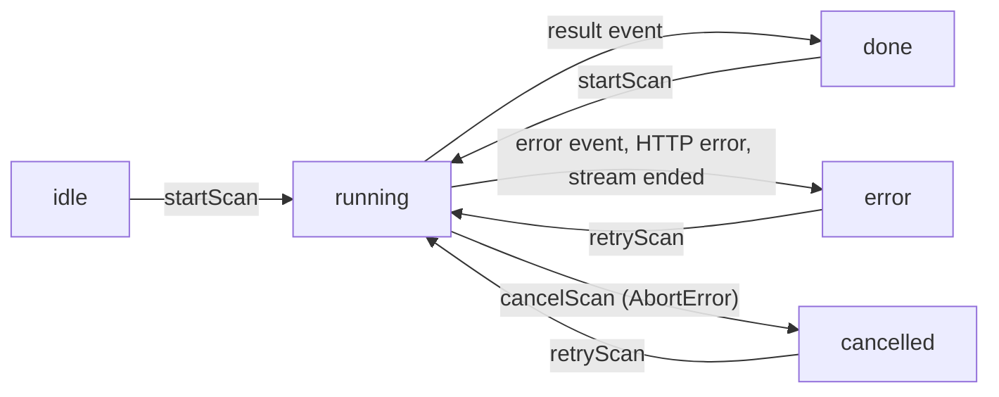

# Terminal client

CLOAK Terminal is the client application served under `/app`. This document covers its routes, session model, state store, streaming scan client, server-state queries, report export and import, print behavior, accessibility and explorer-link policy.

## Contents

- [Routes](#routes)
- [Provider tree](#provider-tree)
- [Entry screen and session model](#entry-screen-and-session-model)
- [State store](#state-store)
- [Scan state machine](#scan-state-machine)
- [Persistence rules](#persistence-rules)
- [Streaming scan client](#streaming-scan-client)
- [Server-state queries (TanStack Query)](#server-state-queries-tanstack-query)
- [Hide balances](#hide-balances)
- [Report export format `cloak-findings/1`](#report-export-format-cloak-findings1)
- [Report import](#report-import)
- [Print and PDF](#print-and-pdf)
- [Sharing a result](#sharing-a-result)
- [Accessibility](#accessibility)
- [Explorer-link policy](#explorer-link-policy)

## Routes

All routes are client components under `app/app/`, wrapped by `app/app/layout.tsx` (which sets `robots: { index: false }`).

| Route | Nav label | Purpose | Data source |
|---|---|---|---|
| `/app` | Overview | Loaded wallet summary: CLOAK Index with component points, balances, interaction types, connection preview, top signals | Loaded `ScanReport` |
| `/app/scan` | CLOAK Scanner | Address form, live stage progress, results (index, coverage, signal cards) | `POST /api/scan` stream |
| `/app/dna` | Wallet DNA | Day × hour heatmap, hour-of-day and weekday distributions, daily activity, interaction categories, program habits, trading patterns, counterparty concentration | `report.dna` |
| `/app/trace` | Trace Map | React Flow graph of observed transfers; depth, direction, minimum-transaction, labeled-only and search filters; node inspector with evidence | `report.graph`; depth 2 via `GET /api/wallet/[address]/graph?depth=2` |
| `/app/signals` | Exposure Signals | Signal list with severity filter, index breakdown, methodology section (`#methodology`) | `report.signals`, `report.score` |
| `/app/reports` | Reports | Printable CLOAK Intelligence Report, JSON export, shareable summary, local history | Loaded report, `history` |
| `/app/settings` | Settings | Data mode, hide balances, clear history, reset session, session, wallet connection, API status, notices | `useHealth()` |

Analysis pages render a "No analysis loaded" panel (`NeedsReport`) when no report is loaded. See [Wallet DNA](06-wallet-dna.md), [Trace Map](09-trace-map.md), [Exposure signals](07-exposure-signals.md).

## Provider tree

```text
AppProviders (components/app/providers.tsx)
└─ QueryClientProvider        staleTime 30 s, retry 1, refetchOnWindowFocus false
   └─ WalletProvider          wallets=[] (Wallet Standard discovery), autoConnect
      └─ TerminalProvider     components/app/store.tsx
         └─ AppShell          components/app/shell.tsx
```

`AppShell` renders an empty `aria-busy` container until the store has hydrated from browser storage, then either the `EntryScreen` (no session) or the sidebar, top bar and page.

Wallet errors are forwarded from `WalletProvider.onError` as a `cloak:wallet-error` window event and shown in the connect dialog ("Connection request was declined in the wallet." or a generic unlock message).

## Entry screen and session model

There are **no accounts and no passwords**. A session is a local record of how the visitor entered the terminal (`components/app/store.tsx`):

```ts
export interface Session {
  kind: 'wallet' | 'saved' | 'viewer'
  address: string | null
  startedAt: string
}
```

| Kind | Entered via | Storage |
|---|---|---|
| `wallet` | **Connect a wallet**: opens the connect dialog; when the wallet connects, the session starts with the connected public key | Session, reports and history in `localStorage` |
| `saved` | **Continue with saved data** (shows the last saved scan and report count), or **Import a report (.json)** | Session, reports and history in `localStorage` |
| `viewer` | **Continue in viewer mode**, or **Explore with demo data** (starts a viewer session, runs a demo scan, navigates to `/app/scan`) | Session in `sessionStorage` only; reports and history in memory only |

**Deep links.** On hydration, if no session exists and the URL has `?demo=1` or `?address=…`, the store starts a `viewer` session instead of showing the entry screen.

- `/app?demo=1`: the `DemoDeepLink` component starts a demo scan of the fictional address and replaces the URL with `/app/scan`.
- `/app/scan?address=<address>`: the Scanner replaces the URL with `/app/scan` and, if the value is a valid Solana address, starts one **live** scan. This is the target of the marketing site's address check.

**Ending a session.** *Sign out* / *Leave viewer mode* aborts any running scan, clears the session record, the loaded report, in-memory history and scan state. It does not delete saved reports. It does not disconnect the wallet; that is a separate action in the top bar menu and in Settings.

## State store

`TerminalProvider` exposes one context (`useTerminal()`):

| Member | Type | Notes |
|---|---|---|
| `hydrated` | `boolean` | `false` until browser storage has been read |
| `session`, `startSession(kind, address?)`, `endSession()` | | See above |
| `savedSummary` | `{ reports, last }` | Count of stored reports and the newest history entry, for the entry screen |
| `settings` | `{ mode: 'live' \| 'demo', hideBalances: boolean }` | Default `{ mode: 'live', hideBalances: false }` |
| `setMode`, `setHideBalances` | | Persist to `cloak:settings` |
| `report` | `ScanReport \| null` | The loaded report |
| `history` | `HistoryEntry[]` | `{ id, address, mode, generatedAt, scannedAt, index, signals }` |
| `scan` | `ScanState` | See [Scan state machine](#scan-state-machine) |
| `startScan(address, mode?)`, `cancelScan()`, `retryScan()` | | `retryScan` re-runs the last address and mode |
| `openReport(id)` | `boolean` | Loads a stored report from `cloak:reports` |
| `importReport(report)` | | See [Report import](#report-import) |
| `clearHistory()`, `resetSession()` | | See [Persistence rules](#persistence-rules) |

Passing a `mode` to `startScan` that differs from the current setting also saves it as the new setting. The top bar shows a Live/Demo switch; in Demo mode the top bar reads `Demo data · fictional`.

## Scan state machine

```ts
export interface ScanState {
  status: 'idle' | 'running' | 'done' | 'error' | 'cancelled'
  address: string | null
  mode: DataMode | null
  stages: Record<ScanStage, StageState>
  error: { code: string; message: string; retryable: boolean; stage: ScanStage | null } | null
  startedAt: number | null
}

export interface StageState {
  status: 'pending' | 'active' | 'done' | 'error'
  detail: string | null
  log: string[]          // last 8 progress lines
  startedAt: number | null
  endedAt: number | null
}
```



Event handling (`startScan` in `components/app/store.tsx`):

| Event | Effect |
|---|---|
| `stage` / `start` | Stage → `active`, `startedAt = ev.at`, `detail` updated |
| `stage` / `done` | Stage → `done`, `endedAt = ev.at`, `detail` updated |
| `progress` | Appended to the stage's `log` (last 8 kept) |
| `error` | Named stage → `error`; scan → `error` with `{ code, message, retryable, stage }` |
| `result` | Report loaded and persisted; scan → `done` |
| Stream closes without `result`/`error` | Scan → `error` with code `stream_ended`, retryable |

The five stages and their labels come from `SCAN_STAGES` in `lib/types.ts`: Establishing Connection, Retrieving Public Activity, Mapping Transactions, Analyzing Exposure, Generating Intelligence Report. Stage timings shown in the UI are server timestamps (`ev.at`); the client adds no pacing. See [Scan protocol](10-scan-protocol.md).

**Abort handling.** Each `startScan` aborts the previous scan's `AbortController` before starting a new one. `cancelScan()` aborts the current one; the pending `fetch`/`read()` rejects with `AbortError` and the scan becomes `cancelled`. On the server, the request's `AbortSignal` is passed into provider calls, so a cancelled live scan stops issuing new provider requests.

**Error UI.** The Scanner shows the failing stage label and error code, states that "No results were substituted. Live scans never fall back to demo data.", offers **Retry** for retryable errors, and offers **Switch to Demo mode** for `not_configured`.

## Persistence rules

Storage keys and what each holds are listed in [Security and privacy](12-security-and-privacy.md#what-the-browser-stores). The rules:

| Rule | Value / behavior |
|---|---|
| `MAX_STORED_REPORTS` | 6 full reports in `cloak:reports`, keeping the newest by `generatedAt` |
| `MAX_HISTORY` | 25 entries in `cloak:history` (and in memory for viewer sessions) |
| Quota shedding | If writing `cloak:reports` fails (for example, quota exceeded), the last report in the object's key order is deleted and the write is retried until it succeeds or one report remains |
| Viewer sessions | `persistReport` updates in-memory history only; nothing is written to `cloak:reports`, `cloak:history` or `cloak:current`. The session record goes to `sessionStorage`. Settings changes are still saved to `cloak:settings` |
| Storage failures | All reads and writes are wrapped in `try/catch`; on failure reads return defaults and writes return `false` |
| Clear history | Removes `cloak:history`, `cloak:reports`, `cloak:current` |
| Reset session | Aborts any scan; removes all five `cloak:*` keys from `localStorage` and the `sessionStorage` session; restores default settings |

The report id is a hash of `mode:address:newest:oldest:txCount` (`reportId` in `lib/analysis/report.ts`). Re-scanning an address whose window has not changed produces the same id, so the stored report and history entry are replaced rather than duplicated.

## Streaming scan client

`streamScan(address, mode, signal)` in `components/app/scanClient.ts` is an async generator over `POST /api/scan`:

1. Sends `{ address, mode }` as JSON. A network failure raises `ScanHttpError('network', …, retryable: true)`.
2. On a non-2xx response (or no body), reads the JSON error envelope and raises `ScanHttpError(error.code ?? 'http_<status>', message, retryable = status === 429 || status >= 500)`.
3. Otherwise reads the body with a `ReadableStream` reader and `TextDecoder` (streaming mode), splits on `\n`, and yields each non-empty line parsed as a `ScanEvent`. A trailing line without a newline is parsed at end of stream.

```ts
// components/app/scanClient.ts (trimmed)
while (true) {
  const { value, done } = await reader.read()
  if (done) break
  buffer += decoder.decode(value, { stream: true })
  let nl: number
  while ((nl = buffer.indexOf('\n')) >= 0) {
    const line = buffer.slice(0, nl).trim()
    buffer = buffer.slice(nl + 1)
    if (line) yield JSON.parse(line) as ScanEvent
  }
}
```

The client does not send `limit`; the server applies `CLOAK_MAX_TX`.

## Server-state queries (TanStack Query)

The scan itself is not a query; it is driven by the store. Two queries exist (`components/app/hooks.ts`):

| Hook | Key | Endpoint | Options |
|---|---|---|---|
| `useHealth()` | `['health']` | `GET /api/health` | `refetchInterval: 60_000`, `staleTime: 30_000` |
| `useGraph(address, mode, 2, enabled)` | `['graph', address, mode, depth]` | `GET /api/wallet/[address]/graph?mode=&depth=2` | `enabled` only when the Trace Map depth is set to 2 and a report is loaded; `staleTime: 5 min` |

`useHealth` drives the top bar status (`System status: online` / `degraded` / `Live data: not configured` / `unreachable`) and the Settings → API status card. Because refetching uses the default `refetchIntervalInBackground: false`, polling pauses while the tab is hidden.

The depth-1 graph is not fetched: it is part of the report. If the depth-2 request fails, the Trace Map keeps showing the first hop and displays "Second hop failed: … Showing first hop only." with a Retry button.

The terminal does not call `/api/wallet/[address]/summary` or `/api/wallet/[address]/transactions`; those routes exist for API consumers. See [API reference](11-api-reference.md).

## Hide balances

`settings.hideBalances` (Settings → **Hide balances**) masks values at render time using the formatters in `components/app/format.ts`:

| Formatter | Hidden output |
|---|---|
| `fmtSol` | `•••• SOL` |
| `fmtUsd` | `$••••` (`—` when no price is published, hidden or not) |
| `fmtAmount` | `••••` |
| Per-counterparty SOL in/out (Reports table) | `••` |

It applies to the Overview balances and the printed report. It does not alter the stored report, the JSON export, or the shareable summary (the summary's balance line is controlled separately by its own opt-in checkbox).

## Report export format `cloak-findings/1`

**Reports → JSON** downloads `cloak-<reportId>.json` (with a `-DEMO` suffix for demo reports) built by `findingsJson` in `components/app/reportExport.ts`:

| Field | Type | Content |
|---|---|---|
| `format` | `"cloak-findings/1"` | Format identifier |
| `reportId` | `string` | `GR-…` report id |
| `mode` | `"live" \| "demo"` | Data mode |
| `demo` | `boolean` | `mode === 'demo'` |
| `address` | `string` | Full analyzed address |
| `generatedAt` | ISO 8601 string | Report time (fixed `2026-09-30T21:00:00.000Z` for demo) |
| `methodologyVersion` | `string` | `cloak-index/1.0` |
| `coverage` | `Coverage` | Window: counts, oldest/newest, span, pages, requested limit, `limitReached`, `fetchedAt` |
| `cloakIndex` | `CloakIndex` | Scored or insufficient, with components |
| `labelSupport` | `LabelSupport` | `supported`, `unsupported-plan`, `unavailable` or `demo` |
| `walletLabel` | `PublicLabel \| null` | Label on the analyzed address itself |
| `signals` | `ExposureSignal[]` | All signals with evidence, limitation and recommendation |
| `counterparties` | `Counterparty[]` | First 50 counterparties |
| `balances` | `WalletBalances` | SOL and holdings at scan time |
| `report` | `ScanReport` | The complete report, so the file can be re-imported |

Types are defined in [`reference/types.ts`](../reference/types.ts); the embedded report validates against [`reference/ScanReport.schema.json`](../reference/ScanReport.schema.json). A captured example is [`examples/findings-export.demo.json`](../examples/findings-export.demo.json) (its `report` field is replaced by a pointer for size; the full report is [`examples/report.demo.json`](../examples/report.demo.json)).

The export contains the full address, balances, counterparties and evidence. It is not redacted.

## Report import

**Import a report (.json)** on the entry screen calls `parseReportFile` (`components/app/reportImport.ts`):

1. Rejects files larger than `MAX_IMPORT_BYTES` = 5 MB.
2. Parses JSON; on failure, "Not a valid JSON file."
3. Validates with Zod: `format` must be the literal `cloak-findings/1` and `report` must structurally match the fields the terminal renders: `id` matching `^GR-[A-Z0-9]+$`, a valid Solana `address`, `mode`, `balances` (`sol`, `lamports`, `holdings[]`), `coverage` (`txCount`, `limitReached`), `counterparties[]` (`address`, `txCount`), `counterpartyTotal`, `graph` (`center`, `nodes[]`, `edges[]`), `dna` (`heatmap` as a number matrix, `hourly`), `signals[]` (`id`, `title`, `severity`), `score` (`status`, `components[]`), `labelSupport`, `methodologyVersion`, `recent[]`. Unknown fields pass through.
4. A file with the right `format` but no valid `report` gets "This export predates full-report exports and cannot be reopened. Run a new scan." Any other mismatch gets "This file is not a CLOAK report export (JSON from Reports → JSON)."

On success the store starts a `saved` session (if none exists), loads the report and persists it like a fresh scan.

**What import does not prove.** The check is structural. It does not verify that the file was produced by CLOAK, that its findings match the chain, or that it was not edited; there is no signature on exports. The current UI does not visually distinguish an imported report from a scanned one; use **Re-scan this address** on the Scanner to regenerate it from source data.

## Print and PDF

**Reports → PDF / Print** calls `window.print()`. The print stylesheet in `app/globals.css`:

- sets `@page { size: A4; margin: 14mm }`;
- forces a white background and dark text;
- hides `.no-print` elements: the sidebar, top bar, page header actions and the Reports side panel (shareable summary, local history);
- strips backgrounds, shadows and colors inside `.print-surface` (the report article) and underlines its links;
- applies `break-inside: avoid` to `.print-break` sections (cards, signal entries, report sections).

The printed report contains the full analyzed address. With **Hide balances** on, balances and per-counterparty SOL amounts are masked. Demo reports carry the DEMO badge and the line "Fictional wallet. Every value in this report is simulated."

## Sharing a result

The Reports page has a **Share result** panel (`components/app/ShareResult.tsx`; the scanner's results header links to it as `/app/reports#share`). It derives a parameter set from the loaded report with `shareParamsFromReport` (`lib/share.ts`):

```ts
{ i: score.value | 'na', b: score.band, h: #high, m: #medium, l: #low, tx: coverage.txCount, d: mode === 'demo' ? '1' : '0', v: methodologyVersion }
```

and offers:

| Action | Behaviour |
|---|---|
| Preview | `` — the exact thumbnail others will see |
| Copy link | Copies `{origin}/share?…` |
| Post on X | Opens `https://x.com/intent/post` with a prefilled text and the share link |
| Download image | Fetches the PNG and saves `cloak-index-<i>[-demo].png` |
| Share… | Web Share API (`navigator.share`), attaching the PNG as a file when `navigator.canShare({ files })` allows; falls back to an "Open share page" link where the API is unavailable |

**Privacy property.** The link and image carry only the index, band, signal counts, window size, demo flag and methodology version — never the address, balances, counterparties or signatures. `tests/share.test.ts` asserts that the generated query contains none of the demo report's address, counterparty addresses or transaction signatures, and exactly the eight keys above.

**Trust property.** Share links are not signed. Anyone can construct one with arbitrary in-range values, so the `/share` page labels them as unverified.

## Accessibility

- **Scan progress.** The stage list is an `<ol aria-label="Scan stages" aria-live="polite">`, so screen readers announce stage changes. Errors render in a `role="alert"` region.
- **CLOAK Index.** The gauge is `role="meter"` with `aria-valuemin=0`, `aria-valuemax=100`, `aria-valuenow` and `aria-label="CLOAK Index"`; the 20-segment bar is `aria-hidden`. The count-up animation is skipped under `prefers-reduced-motion: reduce`, and a global reduced-motion rule shortens CSS animations and transitions.
- **Keyboard focus.** `:focus-visible` draws a 1 px outline with a 3 px offset on all focusable elements. The connect dialog is `role="dialog"` `aria-modal="true"`, focuses its first button on open and closes on Escape.
- **Controls.** Mode and filter switches are `role="radiogroup"` with `role="radio"`/`aria-checked`; toggles are `role="switch"`; signal cards are buttons with `aria-expanded`/`aria-controls`; active nav links carry `aria-current="page"`; the address field links its help or error text through `aria-describedby` and sets `aria-invalid`.
- **Status.** The top bar system status is `aria-live="polite"`.

## Explorer-link policy

Explorer links are built by `explorer` in `lib/solana/address.ts` (`https://solscan.io/tx/…`, `/account/…`, `/token/…`) and rendered by `Address` and `EvidenceList` in `components/app/ui.tsx`:

- **Live mode:** addresses get an "Open in Solscan" link; evidence rows link transactions, accounts and token mints to Solscan. Links use `target="_blank" rel="noreferrer noopener"`.
- **Demo mode:** no explorer links are rendered. Evidence rows show `demo · no record` ("Fictional demo reference — no explorer record"), because fictional addresses and signatures have no on-chain record.

See also: [Scan protocol](10-scan-protocol.md) · [API reference](11-api-reference.md) · [Security and privacy](12-security-and-privacy.md) · [Demo dataset](14-demo-dataset.md)
